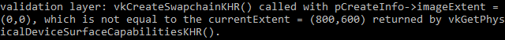

# Presentation: Swap Chain

Vulkan에는 "기본 프레임버퍼"라는 개념이 없기 때문에, 화면에 시각화하기 전에 렌더링할 버퍼를 소유할 인프라가 필요합니다. 이 인프라는 스왑 체인(swap chain)으로 알려져 있으며, Vulkan에서 명시적으로 생성해야 합니다. 스왑 체인은 본질적으로 화면에 표시되기를 기다리는 이미지들의 큐입니다. 애플리케이션은 이러한 이미지를 획득하여 렌더링한 후 다시 큐에 반환합니다. 큐가 정확히 어떻게 작동하는지와 큐에서 이미지를 표시하기 위한 조건은 스왑 체인의 설정 방식에 따라 다르지만, 스왑 체인의 일반적인 목적은 화면의 새로 고침 속도와 이미지 표시를 동기화하는 것입니다.

## Checking for swap chain support

모든 그래픽 카드가 화면에 이미지를 직접 표시할 수 있는 것은 아닙니다. 예를 들어, 서버용으로 설계된 그래픽 카드는 디스플레이 출력이 없을 수 있습니다. 또한 이미지 표시가 창 시스템과 창과 연관된 표면에 크게 의존하기 때문에, 이는 Vulkan 코어의 일부가 아닙니다. `VK_KHR_swapchain` 디바이스 확장을 쿼리한 후 지원 여부를 확인하여 활성화해야 합니다.

이를 위해 먼저 `isDeviceSuitable` 함수를 확장하여 이 확장이 지원되는지 확인합니다. 이전에 `VkPhysicalDevice`에서 지원되는 확장을 나열하는 방법을 살펴본 적이 있으므로, 이는 비교적 간단합니다. Vulkan 헤더 파일에는 `VK_KHR_swapchain`으로 정의된 `VK_KHR_SWAPCHAIN_EXTENSION_NAME` 매크로가 제공됩니다. 이 매크로를 사용하면 철자가 틀렸을 때 컴파일러가 이를 감지할 수 있다는 장점이 있습니다.

먼저 활성화할 장치 확장 목록을, 검증 레이어 목록과 유사하게 선언하세요.

```C++
const std::vector<const char*> deviceExtensions = {
    VK_KHR_SWAPCHAIN_EXTENSION_NAME
};
```

다음으로, `isDeviceSuitable` 함수에서 추가 확인으로 호출할 새로운 함수 `checkDeviceExtensionSupport`를 생성하세요.

```C++
bool isDeviceSuitable(VkPhysicalDevice device) {
    QueueFamilyIndices indices = findQueueFamilies(device);

    bool extensionsSupported = checkDeviceExtensionSupport(device);

    return indices.isComplete() && extensionsSupported;
}

bool checkDeviceExtensionSupport(VkPhysicalDevice device) {
    return true;
}
```

이 함수의 본문을 수정하여 확장을 열거하고 필요한 확장이 모두 포함되어 있는지 확인하세요.

```C++
bool checkDeviceExtensionSupport(VkPhysicalDevice device) {
    uint32_t extensionCount;
    vkEnumerateDeviceExtensionProperties(device, nullptr, &extensionCount, nullptr);

    std::vector<VkExtensionProperties> availableExtensions(extensionCount);
    vkEnumerateDeviceExtensionProperties(device, nullptr, &extensionCount, availableExtensions.data());

    std::set<std::string> requiredExtensions(deviceExtensions.begin(), deviceExtensions.end());

    for (const auto& extension : availableExtensions) {
        requiredExtensions.erase(extension.extensionName);
    }

    return requiredExtensions.empty();
}
```

여기서는 확인되지 않은 필수 확장을 나타내기 위해 문자열 집합(set)을 사용하는 방법을 선택했습니다. 이를 통해 사용 가능한 확장 목록을 열거하면서 쉽게 항목을 제거할 수 있습니다. 물론 `checkValidationLayerSupport`에서와 같이 중첩 루프를 사용할 수도 있습니다. 성능 차이는 무의미합니다. 이제 코드를 실행하여 그래픽 카드가 실제로 스왑 체인을 생성할 수 있는지 확인하세요.

참고로, 이전 장에서 확인했던 표시 큐의 가용성은 스왑 체인 확장이 지원되어야 함을 암시합니다. 하지만 명시적으로 확인하는 것이 좋으며, 확장은 명시적으로 활성화되어야 합니다.

## Enabling device extensions

스왑 체인을 사용하려면 먼저 `VK_KHR_swapchain` 확장을 활성화해야 합니다. 확장을 활성화하려면 논리적 장치 생성 구조에서 작은 변경이 필요합니다:

```C++
createInfo.enabledExtensionCount = static_cast<uint32_t>(deviceExtensions.size());
createInfo.ppEnabledExtensionNames = deviceExtensions.data();
```

확장을 활성화할 때 `createInfo.enabledExtensionCount = 0;` 라는 기존 코드를 교체해야 합니다.

## Querying details of swap chain support

스왑 체인이 사용 가능한지 확인하는 것만으로는 충분하지 않습니다. 왜냐하면 그것이 실제로 우리의 창 표면과 호환되지 않을 수 있기 때문입니다. 스왑 체인을 생성하는 과정은 인스턴스와 장치 생성보다 훨씬 더 많은 설정을 필요로 하므로, 진행하기 전에 더 많은 세부 정보를 조회해야 합니다.

기본적으로 확인해야 할 세 가지 종류의 속성은 다음과 같습니다:

- 기본 표면 능력 (스왑 체인에 포함될 이미지의 최소/최대 개수, 이미지의 최소/최대 너비 및 높이)
- 표면 형식 (픽셀 형식, 색 공간)
- 사용 가능한 표시 모드

`findQueueFamilies` 함수와 비슷하게, 이러한 세부 사항을 조회한 후에는 구조체를 사용하여 해당 정보를 전달할 것입니다. 위에서 언급한 세 가지 유형의 속성은 다음과 같은 구조체와 구조체 목록 형태로 제공됩니다:

```C++
struct SwapChainSupportDetails {
    VkSurfaceCapabilitiesKHR capabilities;
    std::vector<VkSurfaceFormatKHR> formats;
    std::vector<VkPresentModeKHR> presentModes;
};
```

이제 `querySwapChainSupport`라는 새 함수를 생성하여 이 구조체를 채울 것입니다.

```C++
SwapChainSupportDetails querySwapChainSupport(VkPhysicalDevice device) {
    SwapChainSupportDetails details;

    return details;
}
```

이 섹션에서는 이 정보를 포함하는 구조체들을 쿼리하는 방법을 다룹니다. 이러한 구조체들의 의미와 정확히 어떤 데이터를 포함하고 있는지에 대한 자세한 내용은 다음 섹션에서 설명됩니다.

먼저 기본 표면 능력부터 시작하겠습니다. 이러한 속성은 간단히 쿼리할 수 있으며 `VkSurfaceCapabilitiesKHR` 구조체 하나에 반환됩니다.

```C++
vkGetPhysicalDeviceSurfaceCapabilitiesKHR(device, surface, &details.capabilities);
```

이 함수는 지정된 `VkPhysicalDevice`와 `VkSurfaceKHR` 창 표면을 고려하여 지원되는 능력을 결정합니다. 모든 지원 쿼리 함수는 첫 번째 매개변수로 이 두 가지를 받습니다. 왜냐하면 이 두 가지가 스왑 체인의 핵심 요소이기 때문입니다.

다음 단계는 지원되는 표면 형식을 쿼리하는 것입니다. 이것은 구조체 목록이므로 두 번의 함수 호출로 처리됩니다:

```C++
uint32_t formatCount;
vkGetPhysicalDeviceSurfaceFormatsKHR(device, surface, &formatCount, nullptr);

if (formatCount != 0) {
    details.formats.resize(formatCount);
    vkGetPhysicalDeviceSurfaceFormatsKHR(device, surface, &formatCount, details.formats.data());
}
```

사용 가능한 모든 형식을 저장할 수 있도록 벡터의 크기를 조정해야 합니다. 마지막으로, 지원되는 표시 모드를 쿼리하는 것도 `vkGetPhysicalDeviceSurfacePresentModesKHR` 함수로 정확히 동일한 방식으로 진행됩니다.

```C++
uint32_t presentModeCount;
vkGetPhysicalDeviceSurfacePresentModesKHR(device, surface, &presentModeCount, nullptr);

if (presentModeCount != 0) {
    details.presentModes.resize(presentModeCount);
    vkGetPhysicalDeviceSurfacePresentModesKHR(device, surface, &presentModeCount, details.presentModes.data());
}
```

모든 세부 사항은 이제 구조체에 저장되었으므로, 다시 한 번 `isDeviceSuitable` 함수를 확장하여 이 함수를 활용하고 스왑 체인 지원이 적절한지 확인할 수 있습니다. 이 튜토리얼에서는 최소한 하나의 지원되는 이미지 형식과 하나의 지원되는 표시 모드가 창 표면에 대해 존재한다면 스왑 체인 지원이 충분하다고 간주합니다.

```C++
bool swapChainAdequate = false;
if (extensionsSupported) {
    SwapChainSupportDetails swapChainSupport = querySwapChainSupport(device);
    swapChainAdequate = !swapChainSupport.formats.empty() && !swapChainSupport.presentModes.empty();
}
```

스왑 체인 지원을 쿼리하려고 시도하기 전에 확장 기능이 사용 가능한지 확인하는 것이 중요합니다. 함수의 마지막 라인은 다음과 같이 변경됩니다:

```C++
return indices.isComplete() && extensionsSupported && swapChainAdequate;
```

## Choosing the right settings for the swap chain

스왑 체인 설정을 위한 조건이 충족되었다면 지원이 충분하다고 할 수 있지만, 여전히 다양한 최적화 수준의 모드들이 존재할 수 있습니다. 이제 우리는 최적의 스왑 체인을 찾기 위한 설정을 결정하는 두 가지 함수를 작성할 것입니다. 결정해야 할 세 가지 설정이 있습니다:

- 서페이스 포맷 (색 깊이)
- 프레젠테이션 모드 (화면에 이미지를 "교환"하는 조건)
- 스왑 익스텐트 (스왑 체인에서 이미지의 해상도)

이 설정들 각각에 대해 우리는 이상적인 값을 가지고 있으며, 그것이 가능하다면 그 값을 사용하고, 그렇지 않으면 다음으로 최적의 값을 찾기 위한 로직을 구현할 것입니다.

### Surface  format

이 설정을 위한 함수는 다음과 같이 시작됩니다. 나중에 `SwapChainSupportDetails` 구조체의 `formats` 멤버를 인자로 전달할 것입니다.

```C++
VkSurfaceFormatKHR chooseSwapSurfaceFormat(const std::vector<VkSurfaceFormatKHR>& availableFormats) {

}
```

각 `VkSurfaceFormatKHR` 항목은 `format`과 `colorSpace` 멤버를 포함합니다. `format` 멤버는 색상 채널과 유형을 지정합니다. 예를 들어, VK_FORMAT_B8G8R8A8_SRGB는 B, G, R 및 알파 채널을 그 순서대로 저장하며, 각 채널은 8비트 부호 없는 정수로 총 32비트/픽셀을 차지합니다. `colorSpace` 멤버는 SRGB 색 공간이 지원되는지 여부를 나타내며, `VK_COLOR_SPACE_SRGB_NONLINEAR_KHR` 플래그를 사용합니다. 이 플래그는 사양의 이전 버전에서는 `VK_COLORSPACE_SRGB_NONLINEAR_KHR`로 호출되었음을 유의해야 합니다.

색 공간으로는 SRGB가 사용 가능한 경우 이를 선택할 것입니다. [SRGB는 더 정확한 색을 인식할 수 있게 하며](https://stackoverflow.com/questions/12524623/what-are-the-practical-differences-when-working-with-colors-in-a-linear-vs-a-no), 이후 사용할 텍스처와 같은 이미지의 표준 색 공간이기도 합니다. 이 때문에 우리는 `VK_FORMAT_B8G8R8A8_SRGB`와 같은 SRGB 색 포맷을 사용해야 합니다.

이제 목록을 살펴보고 이 선호하는 조합이 사용 가능한지 확인해 봅시다:

```C++
for (const auto& availableFormat : availableFormats) {
    if (availableFormat.format == VK_FORMAT_B8G8R8A8_SRGB && availableFormat.colorSpace == VK_COLOR_SPACE_SRGB_NONLINEAR_KHR) {
        return availableFormat;
    }
}
```

만약 그것도 실패한다면, 우리는 사용할 수 있는 형식을 얼마나 "좋은지"에 따라 순위를 매기기 시작할 수 있지만, 대부분의 경우 첫 번째로 지정된 형식으로 결정하는 것이 괜찮습니다.

```C++
VkSurfaceFormatKHR chooseSwapSurfaceFormat(const std::vector<VkSurfaceFormatKHR>& availableFormats) {
    for (const auto& availableFormat : availableFormats) {
        if (availableFormat.format == VK_FORMAT_B8G8R8A8_SRGB && availableFormat.colorSpace == VK_COLOR_SPACE_SRGB_NONLINEAR_KHR) {
            return availableFormat;
        }
    }

    return availableFormats[0];
}
```

### Presentation mode

프리젠테이션 모드는 스왑 체인에서 가장 중요한 설정일 수 있습니다. 왜냐하면 이것은 이미지를 화면에 표시하는 실제 조건을 나타내기 때문입니다. Vulkan에는 네 가지 가능한 모드가 있습니다:

- `VK_PRESENT_MODE_IMMEDIATE_KHR`: 애플리케이션에서 제출한 이미지는 즉시 화면으로 전송되며, 이로 인해 화면 찢어짐(티어링)이 발생할 수 있습니다.
- `VK_PRESENT_MODE_FIFO_KHR`: 스왑 체인은 큐 형태로, 화면이 새로 고침될 때 디스플레이가 큐의 앞에서 이미지를 가져가고, 프로그램은 렌더링된 이미지를 큐의 뒤쪽에 삽입합니다. 큐가 가득 차면 프로그램은 대기해야 합니다. 이는 현대 게임에서 볼 수 있는 수직 동기화(vertical sync)와 가장 유사합니다. 화면이 새로 고침되는 시점을 "수직 블랭크(vertical blank)"라고 합니다.
- `VK_PRESENT_MODE_FIFO_RELAXED_KHR`: 이 모드는 이전 모드와 차이가 있습니다. 애플리케이션이 늦어지고 큐가 마지막 수직 블랭크 시에 비어 있었을 경우, 대기하는 대신 이미지는 도착 즉시 바로 전송됩니다. 이로 인해 화면 찢어짐(티어링)이 발생할 수 있습니다.
- `VK_PRESENT_MODE_MAILBOX_KHR`: 이는 두 번째 모드의 또 다른 변형입니다. 큐가 가득 차면 애플리케이션을 차단하는 대신, 이미 큐에 있는 이미지는 최신 이미지로 교체됩니다. 이 모드는 화면 찢어짐을 피하면서 가능한 한 빠르게 프레임을 렌더링할 수 있어, 표준 수직 동기화보다 더 적은 지연 문제를 발생시킵니다. 이는 일반적으로 "삼중 버퍼링(triple buffering)"으로 알려져 있지만, 세 개의 버퍼만 있다고 해서 반드시 프레임 속도가 잠금 해제된 것은 아닙니다.

`VK_PRESENT_MODE_FIFO_KHR` 모드만이 보장되므로, 사용 가능한 최적의 모드를 찾는 함수를 다시 작성해야 합니다.

```C++
VkPresentModeKHR chooseSwapPresentMode(const std::vector<VkPresentModeKHR>& availablePresentModes) {
    return VK_PRESENT_MODE_FIFO_KHR;
}
```

개인적으로 `VK_PRESENT_MODE_MAILBOX_KHR` 모드는 에너지 사용이 중요한 문제가 아니라면 매우 좋은 선택이라고 생각합니다. 이 모드는 수직 블랭크 직전까지 최신 이미지를 렌더링하여 화면 찢어짐을 피하면서도 낮은 지연 시간을 유지할 수 있습니다. 에너지 사용이 더 중요한 모바일 장치에서는 대신 `VK_PRESENT_MODE_FIFO_KHR` 모드를 사용하는 것이 좋습니다. 이제 리스트를 살펴보고 `VK_PRESENT_MODE_MAILBOX_KHR` 모드가 사용 가능한지 확인해 보겠습니다.

```C++
VkPresentModeKHR chooseSwapPresentMode(const std::vector<VkPresentModeKHR>& availablePresentModes) {
    for (const auto& availablePresentMode : availablePresentModes) {
        if (availablePresentMode == VK_PRESENT_MODE_MAILBOX_KHR) {
            return availablePresentMode;
        }
    }

    return VK_PRESENT_MODE_FIFO_KHR;
}
```

### Swap extent

이제 마지막 주요 속성만 남았습니다. 이를 위해 마지막 함수를 추가하겠습니다:

```C++
VkExtent2D chooseSwapExtent(const VkSurfaceCapabilitiesKHR& capabilities) {

}
```

스왑 익스텐트는 스왑 체인 이미지의 해상도이며, 일반적으로 우리가 그리려는 창의 해상도와 정확히 동일합니다 (잠시 후 설명할 예정입니다). 가능한 해상도의 범위는 `VkSurfaceCapabilitiesKHR` 구조체에 정의되어 있습니다. Vulkan은 `currentExtent` 멤버에서 창의 해상도를 일치시키라고 알려줍니다. 그러나 일부 창 관리자에서는 창 해상도와 다르게 설정할 수 있도록 허용하며, 이 경우 `currentExtent`의 너비와 높이를 `uint32_t`의 최대값으로 설정하여 이를 나타냅니다. 이 경우에는 `minImageExtent`와 `maxImageExtent` 범위 내에서 창 해상도와 가장 잘 일치하는 해상도를 선택합니다. 그러나 해상도를 올바른 단위로 지정해야 합니다.

GLFW는 두 가지 단위를 사용하여 크기를 측정합니다: 픽셀과 [화면 좌표](https://www.glfw.org/docs/latest/intro_guide.html#coordinate_systems)입니다. 예를 들어, 우리가 창을 만들 때 지정한 해상도 `{WIDTH, HEIGHT}`는 화면 좌표로 측정됩니다. 하지만 Vulkan은 픽셀 단위로 작업하므로, 스왑 체인 익스텐트도 픽셀로 지정해야 합니다. 불행히도, 고해상도 디스플레이(예: Apple의 Retina 디스플레이)를 사용할 경우 화면 좌표는 픽셀과 일치하지 않습니다. 대신, 높은 픽셀 밀도 덕분에 창의 해상도는 화면 좌표의 해상도보다 더 큽니다. 따라서 Vulkan이 스왑 익스텐트를 자동으로 수정해주지 않으면, 원래 `{WIDTH, HEIGHT}`를 사용할 수 없습니다. 대신, `glfwGetFramebufferSize`를 사용하여 창의 픽셀 해상도를 쿼리한 후 최소 및 최대 이미지 익스텐트와 비교해야 합니다.

```C++
#include <cstdint> // Necessary for uint32_t
#include <limits> // Necessary for std::numeric_limits
#include <algorithm> // Necessary for std::clamp

...

VkExtent2D chooseSwapExtent(const VkSurfaceCapabilitiesKHR& capabilities) {
    if (capabilities.currentExtent.width != std::numeric_limits<uint32_t>::max()) {
        return capabilities.currentExtent;
    } else {
        int width, height;
        glfwGetFramebufferSize(window, &width, &height);

        VkExtent2D actualExtent = {
            static_cast<uint32_t>(width),
            static_cast<uint32_t>(height)
        };

        actualExtent.width = std::clamp(actualExtent.width, capabilities.minImageExtent.width, capabilities.maxImageExtent.width);
        actualExtent.height = std::clamp(actualExtent.height, capabilities.minImageExtent.height, capabilities.maxImageExtent.height);

        return actualExtent;
    }
}
```

`clamp` 함수는 여기서 너비와 높이 값을 구현에서 지원하는 최소 및 최대 확장 범위 사이로 제한하는 데 사용됩니다.

## Creating the swap chain

이제 런타임에서 선택해야 할 사항들을 돕는 모든 헬퍼 함수들이 준비되었으므로, 우리는 실제로 작동하는 스왑 체인을 만들기 위해 필요한 모든 정보를 갖추게 되었습니다.

`createSwapChain` 함수를 작성하여 이러한 호출들의 결과를 활용하고, 논리적 장치 생성 후 `initVulkan`에서 이를 호출하도록 합니다.

```C++
void initVulkan() {
    createInstance();
    setupDebugMessenger();
    createSurface();
    pickPhysicalDevice();
    createLogicalDevice();
    createSwapChain();
}

void createSwapChain() {
    SwapChainSupportDetails swapChainSupport = querySwapChainSupport(physicalDevice);

    VkSurfaceFormatKHR surfaceFormat = chooseSwapSurfaceFormat(swapChainSupport.formats);
    VkPresentModeKHR presentMode = chooseSwapPresentMode(swapChainSupport.presentModes);
    VkExtent2D extent = chooseSwapExtent(swapChainSupport.capabilities);
}
```

이 속성들 외에도 스왑 체인에 얼마나 많은 이미지를 포함할지 결정해야 합니다. 구현에서는 기능을 위해 필요한 최소 이미지 수를 지정합니다:

```C++
uint32_t imageCount = swapChainSupport.capabilities.minImageCount;
```

하지만, 이 최소값에만 맞추면 가끔씩 드라이버가 내부 작업을 완료하기 전에 이미지를 하나 더 렌더링하기 위해 기다려야 할 수 있습니다. 그러므로 최소값보다 하나 더 많은 이미지를 요청하는 것이 좋습니다:

```C++
uint32_t imageCount = swapChainSupport.capabilities.minImageCount + 1;
```

이렇게 할 때 최대 이미지 수를 초과하지 않도록 주의해야 하며, 0은 최대 이미지 수가 없음을 의미하는 특수한 값입니다:

```C++
if (swapChainSupport.capabilities.maxImageCount > 0 && imageCount > swapChainSupport.capabilities.maxImageCount) {
    imageCount = swapChainSupport.capabilities.maxImageCount;
}
```

Vulkan 객체를 생성하는 전통에 따라, 스왑 체인 객체를 생성하려면 큰 구조체를 채워야 합니다. 구조체는 매우 익숙한 형태로 시작합니다:

```C++
VkSwapchainCreateInfoKHR createInfo{};
createInfo.sType = VK_STRUCTURE_TYPE_SWAPCHAIN_CREATE_INFO_KHR;
createInfo.surface = surface;
```


스왑 체인이 어떤 표면(surface)에 연결될지 지정한 후, 스왑 체인 이미지의 세부 사항을 지정합니다:

```C++
createInfo.minImageCount = imageCount;
createInfo.imageFormat = surfaceFormat.format;
createInfo.imageColorSpace = surfaceFormat.colorSpace;
createInfo.imageExtent = extent;
createInfo.imageArrayLayers = 1;
createInfo.imageUsage = VK_IMAGE_USAGE_COLOR_ATTACHMENT_BIT;
```

`imageArrayLayers`는 각 이미지가 구성하는 레이어의 수를 지정합니다. 이는 입체 3D 애플리케이션을 개발하지 않는 한 항상 1입니다. `imageUsage` 비트 필드는 스왑 체인의 이미지에서 어떤 종류의 작업을 사용할지 지정합니다. 이 튜토리얼에서는 이미지를 직접 렌더링할 예정이므로, 이미지는 색상 첨부(color attachment)로 사용됩니다. 또한, 이미지를 별도의 이미지로 먼저 렌더링하여 후처리(post-processing)와 같은 작업을 수행할 수도 있습니다. 이 경우 `VK_IMAGE_USAGE_TRANSFER_DST_BIT`와 같은 값을 사용하여 렌더링된 이미지를 스왑 체인 이미지로 전송하는 메모리 작업을 수행할 수 있습니다.

```C++
QueueFamilyIndices indices = findQueueFamilies(physicalDevice);
uint32_t queueFamilyIndices[] = {indices.graphicsFamily.value(), indices.presentFamily.value()};

if (indices.graphicsFamily != indices.presentFamily) {
    createInfo.imageSharingMode = VK_SHARING_MODE_CONCURRENT;
    createInfo.queueFamilyIndexCount = 2;
    createInfo.pQueueFamilyIndices = queueFamilyIndices;
} else {
    createInfo.imageSharingMode = VK_SHARING_MODE_EXCLUSIVE;
    createInfo.queueFamilyIndexCount = 0; // Optional
    createInfo.pQueueFamilyIndices = nullptr; // Optional
}
```

다음으로, 여러 큐 패밀리에서 사용할 스왑 체인 이미지를 어떻게 처리할지 지정해야 합니다. 그래픽 큐 패밀리와 프리젠테이션 큐가 다를 경우, 우리는 그래픽 큐에서 스왑 체인 이미지를 그리고, 그 이미지를 프리젠테이션 큐에서 제출하게 됩니다. 여러 큐에서 액세스하는 이미지를 처리하는 방법에는 두 가지가 있습니다:

- `VK_SHARING_MODE_EXCLUSIVE`: 이미지는 한 번에 하나의 큐 패밀리에만 속하며, 다른 큐 패밀리에서 사용하려면 명시적으로 소유권을 이전해야 합니다. 이 옵션은 최고의 성능을 제공합니다.
- `VK_SHARING_MODE_CONCURRENT`: 이미지는 명시적인 소유권 이전 없이 여러 큐 패밀리에서 동시에 사용될 수 있습니다.

큐 패밀리가 다를 경우, 이 튜토리얼에서는 소유권 이전에 관한 장을 다루지 않기 위해 동시 모드를 사용합니다. 동시 모드는 소유권이 공유될 큐 패밀리 간에 미리 정의해야 하므로 `queueFamilyIndexCount`와 `pQueueFamilyIndices` 파라미터를 사용하여 지정해야 합니다. 그래픽 큐 패밀리와 프리젠테이션 큐 패밀리가 동일한 경우(대부분의 하드웨어에서 해당), 우리는 독점 모드를 사용해야 합니다. 왜냐하면 동시 모드는 적어도 두 개의 다른 큐 패밀리를 지정해야 하기 때문입니다.

```C++
createInfo.preTransform = swapChainSupport.capabilities.currentTransform;
```

우리는 변환을 지원하는 경우(가능성(`capabilities`)에서 지원되는 변환들(`supportedTransforms`)) 스왑 체인 이미지에 특정 변환을 적용할 수 있습니다. 예를 들어, 90도 시계방향 회전이나 수평 반전 같은 변환이 있습니다. 변환을 원하지 않으면 현재 변환을 지정하면 됩니다.

```C++
createInfo.compositeAlpha = VK_COMPOSITE_ALPHA_OPAQUE_BIT_KHR;
```

`compositeAlpha` 필드는 알파 채널이 창 시스템의 다른 창들과 블렌딩하는 데 사용될지를 지정합니다. 거의 대부분의 경우 알파 채널을 무시하는 것이 좋습니다. 따라서 `VK_COMPOSITE_ALPHA_OPAQUE_BIT_KHR`를 사용합니다.

```C++
createInfo.presentMode = presentMode;
createInfo.clipped = VK_TRUE;
```

`presentMode` 멤버는 그 자체로 의미가 명확합니다. `clipped` 멤버가 `VK_TRUE`로 설정되어 있으면, 이는 다른 창이 그 위에 있어 가려진 픽셀의 색상을 신경 쓰지 않겠다는 의미입니다. 예를 들어, 다른 창이 그 픽셀 위에 있을 경우입니다. 이 픽셀들을 읽고 예측 가능한 결과를 얻어야 하는 경우가 아니면, 클리핑을 활성화하는 것이 최적의 성능을 제공합니다.

```C++
createInfo.oldSwapchain = VK_NULL_HANDLE;
```

마지막 필드는 `oldSwapChain`입니다. Vulkan에서는 애플리케이션 실행 중에 스왑 체인이 무효화되거나 최적화되지 않을 수 있습니다. 예를 들어, 창 크기가 조정되는 경우입니다. 이 경우 스왑 체인은 처음부터 다시 생성해야 하며, 이 필드에는 이전 스왑 체인의 참조가 필요합니다. 이는 복잡한 주제이며, [향후 챕터](https://vulkan-tutorial.com/Drawing_a_triangle/Swap_chain_recreation)에서 더 배우게 될 내용입니다. 지금은 한 번만 스왑 체인을 생성한다고 가정하겠습니다.

이제 `VkSwapchainKHR` 객체를 저장할 클래스 멤버를 추가합니다.

```C++
VkSwapchainKHR swapChain;
```

스왑 체인 생성은 이제 `vkCreateSwapchainKHR`를 호출하는 것으로 간단해졌습니다.

```C++
if (vkCreateSwapchainKHR(device, &createInfo, nullptr, &swapChain) != VK_SUCCESS) {
    throw std::runtime_error("failed to create swap chain!");
}
```

매개변수는 논리 장치, 스왑 체인 생성 정보, 선택적 사용자 지정 할당자, 그리고 핸들을 저장할 변수에 대한 포인터입니다. 특별한 사항은 없습니다. 이 객체는 장치를 종료하기 전에 `vkDestroySwapchainKHR`를 사용하여 정리해야 합니다.

```C++
void cleanup() {
    vkDestroySwapchainKHR(device, swapChain, nullptr);
    ...
}
```

이제 애플리케이션을 실행하여 스왑 체인이 성공적으로 생성되었는지 확인하세요! 만약 이 시점에서 `vkCreateSwapchainKHR`에서 액세스 위반 오류가 발생하거나 'vkGetInstanceProcAddress'를 SteamOverlayVulkanLayer.dll에서 찾을 수 없다는 메시지가 표시되면, Steam 오버레이 레이어에 대한 FAQ 항목을 참조하세요.

검증 레이어가 활성화된 상태에서 `createInfo.imageExtent = extent;` 라인을 제거해 보세요. 그러면 검증 레이어 중 하나가 즉시 실수를 잡고 유용한 메시지를 출력하는 것을 볼 수 있습니다.



## Retrieving the swap chain images

스왑 체인이 이제 생성되었으므로, 남은 작업은 그 안에 있는 `VkImage`의 핸들을 가져오는 것입니다. 우리는 후속 장에서 렌더링 작업 중에 이 핸들을 참조할 것입니다. 핸들을 저장할 클래스 멤버를 추가하세요.

```C++
std::vector<VkImage> swapChainImages;
```

이미지는 스왑 체인을 위해 구현에서 자동으로 생성되며, 스왑 체인이 파괴되면 자동으로 정리되므로 추가적인 정리 코드를 작성할 필요는 없습니다.

저는 `vkCreateSwapchainKHR` 호출 직후, `createSwapChain` 함수 끝에 핸들을 가져오는 코드를 추가하고 있습니다. 핸들을 가져오는 것은 이전에 Vulkan에서 객체 배열을 가져오는 방식과 매우 유사합니다. 스왑 체인에서 최소한의 이미지 수만 지정했기 때문에 구현에서는 더 많은 이미지를 생성할 수 있습니다. 따라서 먼저 `vkGetSwapchainImagesKHR`로 최종 이미지 수를 쿼리한 후, 컨테이너의 크기를 조정하고 다시 호출하여 핸들을 가져옵니다.

```C++
vkGetSwapchainImagesKHR(device, swapChain, &imageCount, nullptr);
swapChainImages.resize(imageCount);
vkGetSwapchainImagesKHR(device, swapChain, &imageCount, swapChainImages.data());
```

마지막으로, 선택한 스왑 체인 이미지의 포맷과 해상도를 멤버 변수에 저장하세요. 이것들은 후속 장에서 필요할 것입니다.

```C++
VkSwapchainKHR swapChain;
std::vector<VkImage> swapChainImages;
VkFormat swapChainImageFormat;
VkExtent2D swapChainExtent;

...

swapChainImageFormat = surfaceFormat.format;
swapChainExtent = extent;
```

이제 그릴 수 있고, 창에 표시할 수 있는 이미지 세트를 갖추었습니다. 다음 장에서는 이미지를 렌더 타겟으로 설정하는 방법을 다루고, 그 후에는 실제 그래픽 파이프라인과 그리기 명령을 살펴보겠습니다!

## Source Code
- [C++ code](https://vulkan-tutorial.com/code/06_swap_chain_creation.cpp)