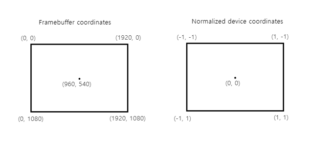
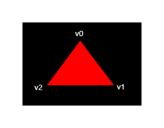
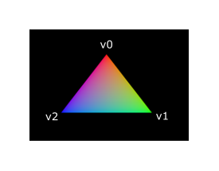

# Shader modules

이전 API와는 달리, Vulkan에서는 셰이더 코드를 GLSL이나 HLSL과 같은 사람이 읽을 수 있는 구문이 아닌 바이트코드 형식으로 작성해야 합니다. 이 바이트코드 형식을 [SPIR-V](https://www.khronos.org/spir/)라고 하며, Vulkan과 OpenCL(모두 Khronos API)에서 사용되도록 설계되었습니다. SPIR-V는 그래픽 및 연산 셰이더를 작성하는 데 사용할 수 있지만, 이 튜토리얼에서는 Vulkan의 그래픽 파이프라인에 사용되는 셰이더에 초점을 맞추겠습니다.

바이트코드 형식을 사용하는 장점은 셰이더 코드를 네이티브 코드로 변환하는 GPU 벤더의 컴파일러가 훨씬 단순해진다는 점입니다. 과거에는 GLSL과 같은 사람이 읽을 수 있는 구문을 사용할 때, 일부 GPU 벤더가 표준을 다소 유연하게 해석하는 경우가 있었습니다. 이러한 벤더의 GPU에서 복잡한 셰이더를 작성하면 다른 벤더의 드라이버가 구문 오류로 인해 코드를 거부하거나, 더 나쁜 경우 컴파일러 버그로 인해 셰이더가 다르게 작동할 위험이 있었습니다. SPIR-V와 같은 명확한 바이트코드 형식을 사용하면 이러한 문제가 발생하지 않을 가능성이 높습니다.

하지만 직접 이 바이트코드를 작성해야 한다는 뜻은 아닙니다. Khronos는 GLSL을 SPIR-V로 컴파일하는 벤더 독립적인 컴파일러를 공개했습니다. 이 컴파일러는 셰이더 코드가 완전히 표준을 준수하는지 검증하고, 프로그램과 함께 배포할 수 있는 SPIR-V 바이너리를 생성합니다. 또한, 이 컴파일러를 라이브러리로 포함해 런타임에 SPIR-V를 생성할 수도 있지만, 이 튜토리얼에서는 다루지 않습니다. 

직접적으로 `glslangValidator.exe`를 사용해도 되지만, 여기서는 Google이 개발한 `glslc.exe`를 사용할 것입니다. `glslc`의 장점은 GCC와 Clang 같은 널리 알려진 컴파일러와 동일한 매개변수 형식을 사용하며, #include와 같은 추가 기능을 제공한다는 점입니다. 두 프로그램 모두 Vulkan SDK에 이미 포함되어 있으므로 별도로 다운로드할 필요는 없습니다.

GLSL은 C 스타일 구문을 사용하는 셰이딩 언어입니다. GLSL로 작성된 프로그램은 모든 객체에 대해 호출되는 `main` 함수를 가지고 있습니다. GLSL은 입력을 위한 매개변수와 출력값으로 반환값을 사용하는 대신, 전역 변수를 통해 입력과 출력을 처리합니다. 이 언어는 벡터와 행렬과 같은 그래픽 프로그래밍에 유용한 기본 제공 프리미티브를 포함하고 있으며, 교차 곱, 행렬-벡터 곱, 벡터를 기준으로 한 반사와 같은 연산을 위한 함수도 제공됩니다.

벡터 타입은 `vec`으로 표시되며, 요소의 수는 숫자로 나타냅니다. 예를 들어, 3D 위치는 `vec3`에 저장할 수 있습니다. 벡터의 개별 구성 요소는 .x와 같은 멤버를 통해 접근할 수 있으며, 여러 구성 요소를 동시에 사용하여 새로운 벡터를 생성하는 것도 가능합니다. 예를 들어, `vec3(1.0, 2.0, 3.0).xy`는 `vec2`를 생성합니다. 벡터의 생성자는 벡터 객체와 스칼라 값을 조합하여 생성할 수도 있습니다. 예를 들어, `vec3(vec2(1.0, 2.0), 3.0)`으로 `vec3`를 생성할 수 있습니다.

이전 챕터에서 언급했듯이, 화면에 삼각형을 표시하려면 버텍스 셰이더와 프래그먼트 셰이더를 작성해야 합니다. 다음 두 섹션에서는 각 셰이더의 GLSL 코드를 다루고, 이후 SPIR-V 바이너리를 생성하고 프로그램에 로드하는 방법을 설명하겠습니다.

## Vertex shader

버텍스 셰이더는 입력으로 전달된 각 정점을 처리합니다. 이 과정에서 월드 좌표, 색상, 법선 벡터, 텍스처 좌표와 같은 정점 속성을 입력받습니다. 출력으로는 클립 좌표에서의 최종 위치와, 색상 및 텍스처 좌표와 같이 프래그먼트 셰이더로 전달해야 할 속성들을 반환합니다. 이러한 값들은 이후 래스터라이저에 의해 조각(fragment) 단위로 보간(interpolation)되어 부드러운 그래디언트를 생성하게 됩니다.

클립 좌표는 버텍스 셰이더에서 생성된 4차원 벡터로, 이 벡터를 마지막 구성 요소로 나누어 **정규화 기기 좌표(Normalized Device Coordinate, NDC)**로 변환됩니다. 이러한 정규화 기기 좌표는 **동차 좌표(Homogeneous Coordinate)**로 간주되며, 프레임버퍼를 [−1,1] x [−1,1]의 좌표 체계에 매핑합니다. 이 좌표 체계는 다음과 같은 형태를 갖습니다:



이전에 컴퓨터 그래픽스를 다뤄본 적이 있다면 이러한 개념에 익숙할 것입니다. 만약 OpenGL을 사용해본 적이 있다면, Y 좌표의 부호가 반대로 바뀌었음을 알 수 있습니다. 또한, Z 좌표의 범위가 Direct3D와 동일한 0에서 1로 변경되었습니다.

첫 번째 삼각형에서는 변환(transform)을 적용하지 않고, 세 개의 정점 위치를 직접 **정규화 기기 좌표(NDC)**로 지정하여 아래와 같은 형태의 삼각형을 생성할 것입니다:



우리는 정규화 기기 좌표(NDC)를 직접 출력할 수 있습니다. 이를 위해 클립 좌표의 마지막 구성 요소를 1로 설정한 상태로 버텍스 셰이더에서 클립 좌표를 출력하면 됩니다. 이렇게 하면 클립 좌표를 정규화 기기 좌표로 변환하기 위한 나눗셈이 아무런 영향을 주지 않습니다.

일반적으로 이러한 좌표는 **버텍스 버퍼(vertex buffer)**에 저장됩니다. 하지만 Vulkan에서 버텍스 버퍼를 생성하고 데이터를 채우는 과정은 간단하지 않습니다. 따라서 먼저 화면에 삼각형이 표시되는 것을 확인한 뒤에 이 작업을 다루기로 하겠습니다. 대신, 여기서는 다소 비정통적인 방법을 사용할 것입니다. 정점 좌표를 버텍스 셰이더 내부에 직접 포함하는 방식입니다. 코드 예시는 다음과 같습니다:

```GLSL
#version 450

vec2 positions[3] = vec2[](
    vec2(0.0, -0.5),
    vec2(0.5, 0.5),
    vec2(-0.5, 0.5)
);

void main() {
    gl_Position = vec4(positions[gl_VertexIndex], 0.0, 1.0);
}
```

`main` 함수는 각 정점에 대해 호출됩니다. 내장 변수 `gl_VertexIndex`는 현재 정점의 인덱스를 포함하고 있습니다. 일반적으로 이 인덱스는 버텍스 버퍼에서 사용되지만, 우리의 경우 하드코딩된 정점 데이터 배열의 인덱스로 사용됩니다.

각 정점의 위치는 셰이더에 정의된 상수 배열에서 접근되며, 여기에 더미 `z` 및 `w` 구성 요소를 추가하여 클립 좌표에서의 위치를 생성합니다. 이 위치는 내장 변수 `gl_Position`을 통해 출력됩니다.

## Fragment shader

버텍스 셰이더에서 지정한 위치로 생성된 삼각형은 화면에서 조각(fragment)으로 표현되는 영역을 채웁니다. 이러한 조각에 대해 **프래그먼트 셰이더(fragment shader)**가 호출되어 프레임버퍼(또는 여러 프레임버퍼)에 대한 색상 및 깊이 값을 생성합니다. 전체 삼각형을 빨간색으로 출력하는 간단한 프래그먼트 셰이더 코드는 다음과 같습니다:

```GLSL
#version 450

layout(location = 0) out vec4 outColor;

void main() {
    outColor = vec4(1.0, 0.0, 0.0, 1.0);
}
```

`main` 함수는 프래그먼트에 대해서도 호출됩니다. 이 방식은 버텍스 셰이더에서 각 정점에 대해 호출되는 것과 같습니다. GLSL에서 색상은 4개의 구성 요소로 이루어진 벡터로, 각각 빨간색(R), 초록색(G), 파란색(B) 및 알파 채널이 [0, 1] 범위 내에 있습니다.

버텍스 셰이더의 `gl_Position`과 달리, 프래그먼트 셰이더에서는 현재 프래그먼트에 대한 색상을 출력할 내장 변수가 없습니다. 대신, 각 프레임버퍼에 대한 출력 변수(예: outColor)를 지정해야 하며, 이 변수는 `layout(location = 0)` 수정자를 사용해 프레임버퍼의 인덱스를 지정합니다. 색상 빨간색은 이 `outColor` 변수에 작성되며, 이는 인덱스 0에 해당하는 첫 번째(그리고 유일한) 프레임버퍼와 연결됩니다.

## Per-vertex colors

전체 삼각형을 빨간색으로 만드는 것은 그다지 흥미롭지 않으므로, 다음과 같은 방식이 훨씬 더 보기 좋지 않을까요?



이러한 효과를 얻기 위해서는 두 셰이더 모두에서 몇 가지 변경을 해야 합니다. 첫째, 세 개의 정점에 대해 각각 다른 색상을 지정해야 합니다. 버텍스 셰이더는 이제 위치와 마찬가지로 색상 배열을 포함해야 합니다.

```GLSL
vec3 colors[3] = vec3[](
    vec3(1.0, 0.0, 0.0),
    vec3(0.0, 1.0, 0.0),
    vec3(0.0, 0.0, 1.0)
);
```

이제 우리는 이 정점별 색상을 프래그먼트 셰이더에 전달하여, 프래그먼트 셰이더가 이를 보간(interpolate)하여 프레임버퍼에 출력할 수 있게 해야 합니다. 버텍스 셰이더에 색상 출력을 추가하고, `main` 함수에서 이를 기록하는 방법은 다음과 같습니다:

```GLSL
layout(location = 0) out vec3 fragColor;

void main() {
    gl_Position = vec4(positions[gl_VertexIndex], 0.0, 1.0);
    fragColor = colors[gl_VertexIndex];
}
```

다음으로, 프래그먼트 셰이더에서 이에 맞는 입력 변수를 추가해야 합니다:

```GLSL
layout(location = 0) in vec3 fragColor;

void main() {
    outColor = vec4(fragColor, 1.0);
}
```

입력 변수는 반드시 같은 이름을 사용할 필요는 없습니다. 대신, `location` 지시문에서 지정된 인덱스를 사용하여 두 변수가 연결됩니다. `main` 함수는 색상과 알파 값을 함께 출력하도록 수정되었습니다. 위 이미지에서 볼 수 있듯이, `fragColor` 값은 세 개의 정점 사이의 프래그먼트들에 대해 자동으로 보간되어 부드러운 그라데이션을 생성합니다.

## Compiling the shaders

프로젝트의 루트 디렉토리에 `shaders`라는 디렉토리를 생성하고, 그 안에 각각 `shader.vert` 파일에 버텍스 셰이더를, `shader.frag` 파일에 프래그먼트 셰이더를 저장하세요. GLSL 셰이더에는 공식적인 확장자가 없지만, 이 두 확장자는 일반적으로 셰이더를 구분하는 데 사용됩니다.

`shader.vert` 파일의 내용은 다음과 같습니다:

```GLSL
#version 450

layout(location = 0) out vec3 fragColor;

vec2 positions[3] = vec2[](
    vec2(0.0, -0.5),
    vec2(0.5, 0.5),
    vec2(-0.5, 0.5)
);

vec3 colors[3] = vec3[](
    vec3(1.0, 0.0, 0.0),
    vec3(0.0, 1.0, 0.0),
    vec3(0.0, 0.0, 1.0)
);

void main() {
    gl_Position = vec4(positions[gl_VertexIndex], 0.0, 1.0);
    fragColor = colors[gl_VertexIndex];
}
```

`shader.frag` 파일의 내용은 다음과 같습니다:

```GLSL
#version 450

layout(location = 0) in vec3 fragColor;

layout(location = 0) out vec4 outColor;

void main() {
    outColor = vec4(fragColor, 1.0);
}
```

이제 우리는 `glslc` 프로그램을 사용하여 이것들을 SPIR-V 바이트코드로 컴파일할 것입니다.

### Windows

`compile.bat` 파일을 다음과 같이 생성하십시오:

```PowerShell
C:/VulkanSDK/x.x.x.x/Bin32/glslc.exe shader.vert -o vert.spv
C:/VulkanSDK/x.x.x.x/Bin32/glslc.exe shader.frag -o frag.spv
pause
```

`glslc.exe`의 경로를 Vulkan SDK를 설치한 경로로 교체하십시오. 파일을 더블 클릭하여 실행하십시오.

### Linux

`compile.sh` 파일을 다음과 같이 생성하십시오:

```Shell
/home/user/VulkanSDK/x.x.x.x/x86_64/bin/glslc shader.vert -o vert.spv
/home/user/VulkanSDK/x.x.x.x/x86_64/bin/glslc shader.frag -o frag.spv
```

`glslc`의 경로를 Vulkan SDK를 설치한 경로로 교체하십시오.` chmod +x compile.sh`로 스크립트를 실행 가능하게 만든 후 실행하십시오.

### End of platform-specific instructions

이 두 명령은 컴파일러에게 GLSL 소스 파일을 읽고 `-o` (출력) 플래그를 사용하여 SPIR-V 바이트코드 파일을 출력하도록 지시합니다.

셰이더에 구문 오류가 있으면 컴파일러가 라인 번호와 문제를 알려줍니다. 예를 들어 세미콜론을 빼고 다시 컴파일 스크립트를 실행해 보세요. 또한, 인수 없이 컴파일러를 실행하여 어떤 종류의 플래그를 지원하는지 확인해 보세요. 예를 들어, 바이트코드를 사람이 읽을 수 있는 형식으로 출력할 수도 있어 셰이더가 정확히 무엇을 하는지와 이 단계에서 적용된 최적화를 볼 수 있습니다.

명령줄에서 셰이더를 컴파일하는 것은 가장 직관적인 방법 중 하나이며, 이 튜토리얼에서는 이 방법을 사용할 것입니다. 하지만 셰이더를 코드 내에서 직접 컴파일하는 것도 가능합니다. Vulkan SDK에는 GLSL 코드를 SPIR-V로 컴파일할 수 있는 libshaderc라는 라이브러리가 포함되어 있습니다.

## Loading a shader

이제 SPIR-V 셰이더를 생성할 수 있는 방법이 생겼으므로, 이를 프로그램에 로드하여 그래픽 파이프라인에 적절히 연결할 때가 되었습니다. 먼저 파일에서 이진 데이터를 로드하는 간단한 도우미 함수를 작성하겠습니다.

```C++
#include <fstream>

...

static std::vector<char> readFile(const std::string& filename) {
    std::ifstream file(filename, std::ios::ate | std::ios::binary);

    if (!file.is_open()) {
        throw std::runtime_error("failed to open file!");
    }
}
```

`readFile` 함수는 지정된 파일에서 모든 바이트를 읽고 이를 `std::vector`로 관리되는 바이트 배열로 반환합니다. 파일을 열 때 두 가지 플래그를 사용합니다:

- `ate`: 파일 끝에서 읽기 시작
- `binary`: 파일을 이진 파일로 읽기 (텍스트 변환 방지)

파일 끝에서 읽기 시작하는 장점은 읽기 위치를 사용하여 파일 크기를 결정하고 버퍼를 할당할 수 있다는 점입니다.

```C++
size_t fileSize = (size_t) file.tellg();
std::vector<char> buffer(fileSize);
```

그 후, 파일의 시작 위치로 돌아가서 모든 바이트를 한 번에 읽습니다:

```C++
file.seekg(0);
file.read(buffer.data(), fileSize);
```

마지막으로 파일을 닫고 바이트를 반환합니다:

```C++
file.close();

return buffer;
```

이제 `createGraphicsPipeline`에서 이 함수를 호출하여 두 셰이더의 바이트코드를 로드합니다:

```C++
void createGraphicsPipeline() {
    auto vertShaderCode = readFile("shaders/vert.spv");
    auto fragShaderCode = readFile("shaders/frag.spv");
}
```

버퍼의 크기를 출력하고 실제 파일 크기와 일치하는지 확인하여 셰이더가 올바르게 로드되었는지 확인하십시오. 이 코드에서는 이진 코드이므로 null 종료 문자가 필요하지 않으며, 나중에 크기를 명시적으로 지정할 것입니다.

## Creating shader modules

파이프라인에 코드를 전달하기 전에, 이를 `VkShaderModule` 객체로 감싸야 합니다. 이를 위해 `createShaderModule`라는 헬퍼 함수를 생성하겠습니다.

```C++
VkShaderModule createShaderModule(const std::vector<char>& code) {

}
```

이 함수는 바이트코드를 담고 있는 버퍼를 매개변수로 받아 `VkShaderModule`을 생성합니다.

셰이더 모듈을 생성하는 것은 간단합니다. 바이트코드가 담긴 버퍼와 그 길이를 지정하면 됩니다. 이 정보는 `VkShaderModuleCreateInfo` 구조체에 지정됩니다. 주의할 점은 바이트코드의 크기가 바이트 단위로 지정되지만, 바이트코드 포인터는 `char` 포인터가 아니라 `uint32_t` 포인터라는 점입니다. 따라서 아래와 같이 reinterpret_cast로 포인터를 캐스팅해야 합니다. 이런 캐스팅을 수행할 때는 데이터가 `uint32_t`의 정렬 요구사항을 충족하는지 확인해야 합니다. 다행히도 데이터는 `std::vector`에 저장되며, 기본 할당자가 이미 최악의 경우 정렬 요구사항을 충족시킵니다.

```C++
VkShaderModuleCreateInfo createInfo{};
createInfo.sType = VK_STRUCTURE_TYPE_SHADER_MODULE_CREATE_INFO;
createInfo.codeSize = code.size();
createInfo.pCode = reinterpret_cast<const uint32_t*>(code.data());
```

`VkShaderModule`는 `vkCreateShaderModule` 호출을 통해 생성할 수 있습니다:

```C++
VkShaderModule shaderModule;
if (vkCreateShaderModule(device, &createInfo, nullptr, &shaderModule) != VK_SUCCESS) {
    throw std::runtime_error("failed to create shader module!");
}
```

매개변수는 이전의 객체 생성 함수들과 동일합니다: 논리 장치, 생성 정보 구조체에 대한 포인터, 선택적인 커스텀 할당자 포인터, 그리고 출력 변수입니다. 코드가 담긴 버퍼는 셰이더 모듈을 생성한 후 즉시 해제할 수 있습니다. 생성된 셰이더 모듈을 반환하는 것도 잊지 마세요:

```C++
return shaderModule;
```

셰이더 모듈은 우리가 이전에 파일에서 로드한 셰이더 바이트코드와 그 안에 정의된 함수들을 감싸는 얇은 래퍼입니다. SPIR-V 바이트코드를 GPU에서 실행할 수 있는 머신 코드로 컴파일하고 링크하는 작업은 그래픽 파이프라인이 생성될 때 이루어집니다. 즉, 그래픽 파이프라인 생성이 완료되면 셰이더 모듈을 다시 삭제할 수 있으므로, 셰이더 모듈은 `createGraphicsPipeline` 함수 내의 지역 변수로 두는 것이 좋습니다. 클래스 멤버로 두지 않도록 하세요.

```C++
void createGraphicsPipeline() {
    auto vertShaderCode = readFile("shaders/vert.spv");
    auto fragShaderCode = readFile("shaders/frag.spv");

    VkShaderModule vertShaderModule = createShaderModule(vertShaderCode);
    VkShaderModule fragShaderModule = createShaderModule(fragShaderCode);
```

정리는 함수 끝에서 `vkDestroyShaderModule`를 두 번 호출하여 처리해야 합니다. 이 장의 나머지 코드는 이들 호출 이전에 삽입됩니다.

```C++
    ...
    vkDestroyShaderModule(device, fragShaderModule, nullptr);
    vkDestroyShaderModule(device, vertShaderModule, nullptr);
}
```

## Shader stage creation

셰이더를 실제로 사용하려면, 셰이더를 특정 파이프라인 단계에 할당해야 합니다. 이를 위해 `VkPipelineShaderStageCreateInfo` 구조체를 사용하여 실제 파이프라인 생성 과정의 일부로 셰이더를 할당합니다.

먼저, `createGraphicsPipeline` 함수 내에서 정점 셰이더에 대한 구조체를 채우는 것으로 시작합니다.

```C++
VkPipelineShaderStageCreateInfo vertShaderStageInfo{};
vertShaderStageInfo.sType = VK_STRUCTURE_TYPE_PIPELINE_SHADER_STAGE_CREATE_INFO;
vertShaderStageInfo.stage = VK_SHADER_STAGE_VERTEX_BIT;
```

첫 번째 단계는 필수적인 `sType` 멤버 외에도 셰이더가 사용될 파이프라인 단계를 지정하는 것입니다. 이전 장에서 설명한 각 프로그래머블 단계에 대해 enum 값이 존재합니다.

```C++
vertShaderStageInfo.module = vertShaderModule;
vertShaderStageInfo.pName = "main";
```

다음 두 멤버는 셰이더 코드가 담긴 셰이더 모듈과 호출할 함수인 엔트리 포인트를 지정합니다. 이는 여러 개의 프래그먼트 셰이더를 하나의 셰이더 모듈로 결합하고, 서로 다른 엔트리 포인트를 사용하여 각기 다른 동작을 구분할 수 있다는 의미입니다. 이 경우에는 표준 `main`을 사용할 것입니다.

하나 더 (선택적) 멤버인 `pSpecializationInfo`가 있으며, 여기에서는 사용하지 않지만 설명할 가치가 있습니다. 이 멤버는 셰이더 상수 값들을 지정할 수 있게 해줍니다. 하나의 셰이더 모듈을 사용하면서 파이프라인 생성 시에 셰이더에서 사용되는 상수들에 대해 다른 값을 지정하여 동작을 설정할 수 있습니다. 이는 렌더링 시 변수를 사용하여 셰이더를 설정하는 것보다 효율적입니다. 컴파일러가 `if` 문 같은 조건문을 최적화할 수 있기 때문입니다. 만약 상수가 없다면, 이 멤버를 `nullptr`로 설정할 수 있으며, 이는 구조체 초기화에서 자동으로 처리됩니다.

구조체를 프래그먼트 셰이더에 맞게 수정하는 것은 간단합니다.

```C++
VkPipelineShaderStageCreateInfo fragShaderStageInfo{};
fragShaderStageInfo.sType = VK_STRUCTURE_TYPE_PIPELINE_SHADER_STAGE_CREATE_INFO;
fragShaderStageInfo.stage = VK_SHADER_STAGE_FRAGMENT_BIT;
fragShaderStageInfo.module = fragShaderModule;
fragShaderStageInfo.pName = "main";
```

마지막으로, 이 두 구조체를 포함하는 배열을 정의하여 실제 파이프라인 생성 단계에서 이를 참조하도록 합니다.

```C++
VkPipelineShaderStageCreateInfo shaderStages[] = {vertShaderStageInfo, fragShaderStageInfo};
```

이로써 파이프라인의 프로그래머블 단계에 대한 설명은 모두 끝났습니다. 다음 장에서는 고정 함수 단계에 대해 살펴보겠습니다.

## Source Code
- [C++ code](https://vulkan-tutorial.com/code/09_shader_modules.cpp)
- [Vertex shader](https://vulkan-tutorial.com/code/09_shader_base.vert)
- [Fragment shader](https://vulkan-tutorial.com/code/09_shader_base.frag)