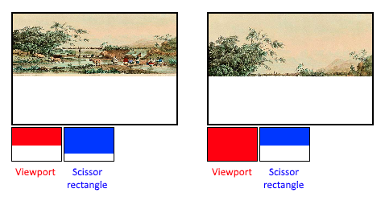

# Fixed functions

구형 그래픽스 API들은 그래픽 파이프라인의 대부분 단계에 대해 기본 상태를 제공했습니다. Vulkan에서는 대부분의 파이프라인 상태를 명시적으로 설정해야 하며, 이는 변경할 수 없는 파이프라인 상태 객체에 포함됩니다. 이 장에서는 이러한 고정 함수 작업들을 구성하기 위한 모든 구조체를 채우는 방법을 다룰 것입니다.

## Dynamic state

그래픽 파이프라인 상태의 대부분은 파이프라인 상태에 포함되어야 하지만, 일부 상태는 그리기 시간에 파이프라인을 다시 생성하지 않고도 변경할 수 있습니다. 예를 들어, 뷰포트 크기, 선 너비, 블렌드 상수 등이 있습니다. 동적 상태를 사용하여 이러한 속성을 제외하려면 다음과 같은 `VkPipelineDynamicStateCreateInfo` 구조체를 채워야 합니다:

```C++
std::vector<VkDynamicState> dynamicStates = {
    VK_DYNAMIC_STATE_VIEWPORT,
    VK_DYNAMIC_STATE_SCISSOR
};

VkPipelineDynamicStateCreateInfo dynamicState{};
dynamicState.sType = VK_STRUCTURE_TYPE_PIPELINE_DYNAMIC_STATE_CREATE_INFO;
dynamicState.dynamicStateCount = static_cast<uint32_t>(dynamicStates.size());
dynamicState.pDynamicStates = dynamicStates.data();
```

이렇게 하면 이러한 값들의 구성이 무시되고, 그리기 시간에 데이터를 지정할 수 있게 됩니다(그리고 지정해야 합니다). 이는 더 유연한 설정을 가능하게 하며, 뷰포트와 스크리저 상태와 같은 것들에 대해 일반적으로 사용됩니다. 이 값들을 파이프라인 상태에 포함시키면 더 복잡한 설정이 필요하기 때문입니다.

## Vertex input

`VkPipelineVertexInputStateCreateInfo` 구조체는 정점 셰이더로 전달될 정점 데이터의 형식을 설명합니다. 이 구조체는 대체로 두 가지 방식으로 설명됩니다:

- 바인딩(Bindings): 데이터 간의 간격과 데이터가 정점마다 또는 인스턴스마다 처리되는지 여부 (인스턴싱 참조)
- 속성 설명(Attribute descriptions): 정점 셰이더로 전달되는 속성의 유형, 로드할 바인딩 및 오프셋

우리는 정점 데이터를 직접 정점 셰이더에 하드코딩하므로, 지금은 이 구조체를 채워서 정점 데이터를 로드하지 않도록 지정할 것입니다. 정점 버퍼 장에 대해서는 나중에 다룰 예정입니다.

```C++
VkPipelineVertexInputStateCreateInfo vertexInputInfo{};
vertexInputInfo.sType = VK_STRUCTURE_TYPE_PIPELINE_VERTEX_INPUT_STATE_CREATE_INFO;
vertexInputInfo.vertexBindingDescriptionCount = 0;
vertexInputInfo.pVertexBindingDescriptions = nullptr; // Optional
vertexInputInfo.vertexAttributeDescriptionCount = 0;
vertexInputInfo.pVertexAttributeDescriptions = nullptr; // Optional
```

`pVertexBindingDescriptions` 및 `pVertexAttributeDescriptions` 멤버는 정점 데이터를 로드하는 데 필요한 세부 사항을 설명하는 구조체 배열을 가리킵니다. 이 구조체를 `createGraphicsPipeline` 함수에서 `shaderStages` 배열 바로 뒤에 추가하십시오.

## Input assembly

`VkPipelineInputAssemblyStateCreateInfo` 구조체는 두 가지를 설명합니다: 정점에서 그릴 기하학의 종류와 원시 재시작(primitive restart)을 활성화할지 여부입니다. 첫 번째 항목은 `topology` 멤버로 지정되며, 다음과 같은 값을 가질 수 있습니다:

- VK_PRIMITIVE_TOPOLOGY_POINT_LIST: 정점에서 점을 그림
- VK_PRIMITIVE_TOPOLOGY_LINE_LIST: 2개의 정점마다 하나의 선을 그림 (재사용 없음)
- VK_PRIMITIVE_TOPOLOGY_LINE_STRIP: 매 선의 끝 정점이 다음 선의 시작 정점으로 사용됨
- VK_PRIMITIVE_TOPOLOGY_TRIANGLE_LIST: 3개의 정점마다 하나의 삼각형을 그림 (재사용 없음)
- VK_PRIMITIVE_TOPOLOGY_TRIANGLE_STRIP: 매 삼각형의 두 번째 및 세 번째 정점이 다음 삼각형의 첫 번째 두 정점으로 사용됨

보통 정점은 정점 버퍼에서 인덱스를 기준으로 순차적으로 로드되지만, 엘리먼트 버퍼를 사용하면 자신이 사용할 인덱스를 직접 지정할 수 있습니다. 이를 통해 정점을 재사용하는 등의 최적화를 수행할 수 있습니다. `primitiveRestartEnable` 멤버를 `VK_TRUE`로 설정하면, _STRIP 토폴로지 모드에서 `0xFFFF` 또는 `0xFFFFFFFF`와 같은 특수 인덱스를 사용하여 선과 삼각형을 분리할 수 있습니다.

이 튜토리얼에서는 삼각형을 그릴 예정이므로, 우리는 다음과 같은 데이터를 구조체에 사용할 것입니다:

```C++
VkPipelineInputAssemblyStateCreateInfo inputAssembly{};
inputAssembly.sType = VK_STRUCTURE_TYPE_PIPELINE_INPUT_ASSEMBLY_STATE_CREATE_INFO;
inputAssembly.topology = VK_PRIMITIVE_TOPOLOGY_TRIANGLE_LIST;
inputAssembly.primitiveRestartEnable = VK_FALSE;
```

## Viewports and scissors

뷰포트는 기본적으로 출력이 렌더링될 프레임버퍼의 영역을 설명합니다. 이 영역은 거의 항상 `(0, 0)`에서 `(width, height)`까지이며, 이 튜토리얼에서도 동일합니다.

```C++
VkViewport viewport{};
viewport.x = 0.0f;
viewport.y = 0.0f;
viewport.width = (float) swapChainExtent.width;
viewport.height = (float) swapChainExtent.height;
viewport.minDepth = 0.0f;
viewport.maxDepth = 1.0f;
```

스왑 체인과 그 이미지의 크기가 창의 `WIDTH`와 `HEIGHT`와 다를 수 있다는 점을 기억하세요. 스왑 체인 이미지는 나중에 프레임버퍼로 사용되므로, 우리는 그 크기에 맞춰야 합니다.

`minDepth`와 `maxDepth` 값은 프레임버퍼에 사용할 깊이 값의 범위를 지정합니다. 이 값들은 [0.0f, 1.0f] 범위 내에 있어야 하지만, `minDepth`는 `maxDepth`보다 클 수도 있습니다. 특별한 작업을 하지 않는다면, 기본 값인 0.0f와 1.0f를 사용하는 것이 좋습니다.

뷰포트는 이미지에서 프레임버퍼로의 변환을 정의하는 반면, 가위 직사각형은 실제로 픽셀이 저장될 영역을 정의합니다. 가위 직사각형 외부의 픽셀은 래스터라이저에 의해 버려집니다. 이들은 변환이 아니라 필터처럼 작용합니다. 차이는 아래 그림에 설명되어 있습니다. 왼쪽 가위 직사각형은 뷰포트보다 크기만 하면 그 이미지가 나오도록 하는 여러 가능성 중 하나에 불과합니다.



따라서 전체 프레임버퍼에 그리려면, 프레임버퍼를 완전히 덮는 가위 직사각형을 지정해야 합니다.

```C++
VkRect2D scissor{};
scissor.offset = {0, 0};
scissor.extent = swapChainExtent;
```

뷰포트와 가위 직사각형은 파이프라인의 정적 부분으로 지정하거나 커맨드 버퍼에서 설정된 동적 상태로 지정할 수 있습니다. 전자는 다른 상태들과 일관성이 있지만, 뷰포트와 가위 상태를 동적으로 설정하는 것이 훨씬 더 유연성을 제공합니다. 이는 매우 일반적이며 모든 구현에서 성능 저하 없이 동적 상태를 처리할 수 있습니다.

동적 뷰포트와 가위 직사각형을 선택할 경우, 파이프라인에 해당 동적 상태를 활성화해야 합니다.

```C++
std::vector<VkDynamicState> dynamicStates = {
    VK_DYNAMIC_STATE_VIEWPORT,
    VK_DYNAMIC_STATE_SCISSOR
};

VkPipelineDynamicStateCreateInfo dynamicState{};
dynamicState.sType = VK_STRUCTURE_TYPE_PIPELINE_DYNAMIC_STATE_CREATE_INFO;
dynamicState.dynamicStateCount = static_cast<uint32_t>(dynamicStates.size());
dynamicState.pDynamicStates = dynamicStates.data();
```

그런 다음 파이프라인 생성 시 해당 개수를 지정하기만 하면 됩니다.

```C++
VkPipelineViewportStateCreateInfo viewportState{};
viewportState.sType = VK_STRUCTURE_TYPE_PIPELINE_VIEWPORT_STATE_CREATE_INFO;
viewportState.viewportCount = 1;
viewportState.scissorCount = 1;
```

실제 뷰포트와 가위 직사각형은 이후 드로잉 시간에 설정됩니다.

동적 상태를 사용하면 하나의 커맨드 버퍼 내에서 다른 뷰포트와 또는 가위 직사각형을 지정할 수 있습니다.

동적 상태가 없으면, 뷰포트와 가위 직사각형은 `VkPipelineViewportStateCreateInfo` 구조체를 사용하여 파이프라인에서 설정해야 합니다. 이로 인해 해당 파이프라인의 뷰포트와 가위 직사각형은 불변하게 됩니다. 이러한 값에 대한 변경이 필요하면 새 값을 사용하여 새 파이프라인을 생성해야 합니다.

```C++
VkPipelineViewportStateCreateInfo viewportState{};
viewportState.sType = VK_STRUCTURE_TYPE_PIPELINE_VIEWPORT_STATE_CREATE_INFO;
viewportState.viewportCount = 1;
viewportState.pViewports = &viewport;
viewportState.scissorCount = 1;
viewportState.pScissors = &scissor;
```

어떤 방식으로 설정하든, 일부 그래픽 카드에서는 여러 개의 뷰포트와 가위 직사각형을 사용할 수 있으므로 구조체 멤버는 이들을 참조하는 배열을 사용합니다. 여러 개를 사용하려면 GPU 기능을 활성화해야 합니다(논리 장치 생성 참조).

## Rasterizer

래스터화기는 버텍스 셰이더에서 형성된 기하학을 프래그먼트로 변환하여 프래그먼트 셰이더에서 색을 입히는 역할을 합니다. 또한 [깊이 테스트](https://en.wikipedia.org/wiki/Z-buffering), [페이스 컬링](https://en.wikipedia.org/wiki/Back-face_culling) 및 가위 테스트를 수행하며, 전체 다각형을 채우거나 가장자리만 출력하는 (와이어프레임 렌더링) 방식으로 설정할 수 있습니다. 이 모든 것은 `VkPipelineRasterizationStateCreateInfo` 구조체를 사용하여 구성됩니다.

```C++
VkPipelineRasterizationStateCreateInfo rasterizer{};
rasterizer.sType = VK_STRUCTURE_TYPE_PIPELINE_RASTERIZATION_STATE_CREATE_INFO;
rasterizer.depthClampEnable = VK_FALSE;
```

`depthClampEnable`이 VK_TRUE로 설정되면, 가까운 평면과 먼 평면을 넘어서는 프래그먼트가 삭제되지 않고 그 평면에 고정됩니다. 이는 그림자 맵과 같은 특별한 경우에 유용합니다. 이를 사용하려면 GPU 기능을 활성화해야 합니다.

```C++
rasterizer.rasterizerDiscardEnable = VK_FALSE;
```

`rasterizerDiscardEnable`이 VK_TRUE로 설정되면, 기하학이 래스터화 단계에 통과하지 않게 됩니다. 이는 사실상 프레임버퍼에 대한 출력을 비활성화하는 효과를 줍니다.

```C++
rasterizer.polygonMode = VK_POLYGON_MODE_FILL;
```

폴리곤 모드(polygonMode)는 기하학을 위해 프래그먼트가 생성되는 방식을 결정합니다. 다음 모드들이 제공됩니다:

- `VK_POLYGON_MODE_FILL`: 폴리곤 영역을 프래그먼트로 채웁니다.
- `VK_POLYGON_MODE_LINE`: 폴리곤의 가장자리를 선으로 그립니다.
- `VK_POLYGON_MODE_POINT`: 폴리곤의 정점을 점으로 그립니다.

fill 외의 모드를 사용하는 경우 GPU 기능을 활성화해야 합니다.

```C++
rasterizer.lineWidth = 1.0f;
```

`lineWidth` 멤버는 간단하게 선의 두께를 프래그먼트 수로 설명합니다. 지원되는 최대 선 두께는 하드웨어에 따라 다르며, 1.0f보다 두꺼운 선은 wideLines GPU 기능을 활성화해야 합니다.

```C++
rasterizer.cullMode = VK_CULL_MODE_BACK_BIT;
rasterizer.frontFace = VK_FRONT_FACE_CLOCKWISE;
```

`cullMode` 변수는 사용할 면 제거(culling)의 유형을 결정합니다. 면 제거를 비활성화하거나, 앞면을 제거하거나, 뒷면을 제거하거나, 둘 다 제거할 수 있습니다. `frontFace` 변수는 앞면으로 간주할 얼굴의 정점 순서를 지정하며, 시계방향 또는 반시계방향일 수 있습니다.

```C++
rasterizer.depthBiasEnable = VK_FALSE;
rasterizer.depthBiasConstantFactor = 0.0f; // Optional
rasterizer.depthBiasClamp = 0.0f; // Optional
rasterizer.depthBiasSlopeFactor = 0.0f; // Optional
```

래스터라이저는 깊이 값을 일정 값만큼 추가하거나 프래그먼트의 기울기를 기준으로 깊이를 편향시킬 수 있습니다. 이는 그림자 맵핑에 사용되기도 하지만, 여기서는 사용하지 않습니다. 따라서 `depthBiasEnable`을 `VK_FALSE`로 설정하면 됩니다.

## Multisampling

`VkPipelineMultisampleStateCreateInfo` 구조체는 다중 샘플링을 구성합니다. 다중 샘플링은 [안티 앨리어싱](https://en.wikipedia.org/wiki/Multisample_anti-aliasing)을 수행하는 방법 중 하나입니다. 여러 개의 다각형이 동일한 픽셀로 래스터화되면 해당 픽셀에 대해 프래그먼트 셰이더 결과를 결합하여 작동합니다. 이는 주로 가장자리에서 발생하며, 이곳에서 가장 눈에 띄는 앨리어싱 아티팩트가 발생합니다. 하나의 다각형만 픽셀에 매핑되면 프래그먼트 셰이더를 여러 번 실행할 필요가 없으므로, 해상도를 높게 설정하고 다운스케일하는 것보다 비용이 훨씬 적습니다. 이를 활성화하려면 GPU 기능을 활성화해야 합니다.

```C++
VkPipelineMultisampleStateCreateInfo multisampling{};
multisampling.sType = VK_STRUCTURE_TYPE_PIPELINE_MULTISAMPLE_STATE_CREATE_INFO;
multisampling.sampleShadingEnable = VK_FALSE;
multisampling.rasterizationSamples = VK_SAMPLE_COUNT_1_BIT;
multisampling.minSampleShading = 1.0f; // Optional
multisampling.pSampleMask = nullptr; // Optional
multisampling.alphaToCoverageEnable = VK_FALSE; // Optional
multisampling.alphaToOneEnable = VK_FALSE; // Optional
```

다중 샘플링은 나중 장에서 다시 다룰 예정이므로, 지금은 이를 비활성화한 상태로 두겠습니다.

## Depth and stencil testing

깊이 및/또는 스텐실 버퍼를 사용하는 경우, `VkPipelineDepthStencilStateCreateInfo`를 사용하여 깊이 및 스텐실 테스트를 구성해야 합니다. 현재 우리는 이를 사용하지 않으므로, 해당 구조체에 대한 포인터 대신 nullptr을 전달하면 됩니다. 깊이 버퍼링 장에서 다시 다룰 예정입니다.

## Color blending

프래그먼트 셰이더가 색상을 반환한 후, 해당 색상은 이미 프레임버퍼에 있는 색상과 결합되어야 합니다. 이 변환을 색상 혼합이라고 하며, 이를 수행하는 두 가지 방법이 있습니다:

- 기존 값과 새로운 값을 섞어서 최종 색상을 생성
- 기존 값과 새로운 값을 비트 연산을 사용하여 결합

색상 혼합을 구성하는 두 가지 유형의 구조체가 있습니다. 첫 번째 구조체인 `VkPipelineColorBlendAttachmentState`는 각 첨부된 프레임버퍼에 대한 구성을 포함하고, 두 번째 구조체인 `VkPipelineColorBlendStateCreateInfo는` 전역 색상 혼합 설정을 포함합니다. 우리의 경우, 하나의 프레임버퍼만 있으므로:

```C++
VkPipelineColorBlendAttachmentState colorBlendAttachment{};
colorBlendAttachment.colorWriteMask = VK_COLOR_COMPONENT_R_BIT | VK_COLOR_COMPONENT_G_BIT | VK_COLOR_COMPONENT_B_BIT | VK_COLOR_COMPONENT_A_BIT;
colorBlendAttachment.blendEnable = VK_FALSE;
colorBlendAttachment.srcColorBlendFactor = VK_BLEND_FACTOR_ONE; // Optional
colorBlendAttachment.dstColorBlendFactor = VK_BLEND_FACTOR_ZERO; // Optional
colorBlendAttachment.colorBlendOp = VK_BLEND_OP_ADD; // Optional
colorBlendAttachment.srcAlphaBlendFactor = VK_BLEND_FACTOR_ONE; // Optional
colorBlendAttachment.dstAlphaBlendFactor = VK_BLEND_FACTOR_ZERO; // Optional
colorBlendAttachment.alphaBlendOp = VK_BLEND_OP_ADD; // Optional
```

이 프레임버퍼별 구조체는 색상 혼합의 첫 번째 방법을 구성할 수 있게 해줍니다. 수행될 연산은 다음과 같은 의사 코드로 가장 잘 설명됩니다:

```C++
if (blendEnable) {
    finalColor.rgb = (srcColorBlendFactor * newColor.rgb) <colorBlendOp> (dstColorBlendFactor * oldColor.rgb);
    finalColor.a = (srcAlphaBlendFactor * newColor.a) <alphaBlendOp> (dstAlphaBlendFactor * oldColor.a);
} else {
    finalColor = newColor;
}

finalColor = finalColor & colorWriteMask;
```

`blendEnable`이 VK_FALSE로 설정되면, 프래그먼트 셰이더에서 나온 새로운 색상은 수정 없이 그대로 전달됩니다. 그렇지 않으면 두 가지 혼합 연산이 수행되어 새로운 색상이 계산됩니다. 결과 색상은 `colorWriteMask`와 AND 연산을 수행하여 실제로 어떤 채널이 통과할지를 결정합니다.

색상 혼합을 가장 일반적으로 사용하는 방법은 알파 혼합을 구현하는 것입니다. 여기서 우리는 새로운 색상이 불투명도에 따라 기존 색상과 혼합되도록 합니다. 최종 색상(finalColor)은 다음과 같이 계산되어야 합니다:

```C++
finalColor.rgb = newAlpha * newColor + (1 - newAlpha) * oldColor;
finalColor.a = newAlpha.a;
```

다음과 같은 매개변수로 이를 구현할 수 있습니다:

```C++
colorBlendAttachment.blendEnable = VK_TRUE;
colorBlendAttachment.srcColorBlendFactor = VK_BLEND_FACTOR_SRC_ALPHA;
colorBlendAttachment.dstColorBlendFactor = VK_BLEND_FACTOR_ONE_MINUS_SRC_ALPHA;
colorBlendAttachment.colorBlendOp = VK_BLEND_OP_ADD;
colorBlendAttachment.srcAlphaBlendFactor = VK_BLEND_FACTOR_ONE;
colorBlendAttachment.dstAlphaBlendFactor = VK_BLEND_FACTOR_ZERO;
colorBlendAttachment.alphaBlendOp = VK_BLEND_OP_ADD;
```

모든 가능한 연산은 명세에서 `VkBlendFactor` 및 `VkBlendOp` 열거형에서 찾을 수 있습니다.

두 번째 구조체는 모든 프레임버퍼에 대한 구조체 배열을 참조하고, 위에서 설명한 계산에서 사용할 수 있는 블렌드 상수를 설정할 수 있게 해줍니다.

```C++
VkPipelineColorBlendStateCreateInfo colorBlending{};
colorBlending.sType = VK_STRUCTURE_TYPE_PIPELINE_COLOR_BLEND_STATE_CREATE_INFO;
colorBlending.logicOpEnable = VK_FALSE;
colorBlending.logicOp = VK_LOGIC_OP_COPY; // Optional
colorBlending.attachmentCount = 1;
colorBlending.pAttachments = &colorBlendAttachment;
colorBlending.blendConstants[0] = 0.0f; // Optional
colorBlending.blendConstants[1] = 0.0f; // Optional
colorBlending.blendConstants[2] = 0.0f; // Optional
colorBlending.blendConstants[3] = 0.0f; // Optional
```

두 번째 혼합 방법(비트 연산 결합)을 사용하려면 `logicOpEnable`을 `VK_TRUE`로 설정해야 합니다. 그런 다음 비트 연산은 `logicOp` 필드에서 지정할 수 있습니다. 이 방법을 사용하면 첫 번째 방법이 자동으로 비활성화되며, 마치 모든 프레임버퍼에 대해 `blendEnable`을 `VK_FALSE`로 설정한 것처럼 됩니다! `colorWriteMask`는 이 모드에서 프레임버퍼의 어떤 채널이 실제로 영향을 받을지를 결정하는 데 사용됩니다. 두 모드를 모두 비활성화하는 것도 가능하며, 이 경우 프래그먼트 색상은 수정 없이 프레임버퍼에 기록됩니다.

## Pipeline layout

셰이더에서 `uniform` 값을 사용할 수 있습니다. uniform 값은 동적 상태 변수와 비슷한 전역 변수로, 셰이더를 재생성하지 않고도 그리기 시점에 변경하여 셰이더의 동작을 변경할 수 있습니다. 일반적으로 변환 행렬을 정점 셰이더에 전달하거나, 조각 셰이더에서 텍스처 샘플러를 생성하는 데 사용됩니다.

이러한 uniform 값들은 파이프라인 생성 중에 `VkPipelineLayout` 객체를 생성하여 지정해야 합니다. 우리는 이를 미래 장에서 사용할 예정이지만, 빈 파이프라인 레이아웃을 생성하는 것은 여전히 필요합니다.

이 객체를 다른 함수에서 참조할 수 있도록 클래스 멤버를 생성합니다:

```C++
VkPipelineLayout pipelineLayout;
```

그리고 `createGraphicsPipeline` 함수에서 객체를 생성합니다:

```C++
VkPipelineLayoutCreateInfo pipelineLayoutInfo{};
pipelineLayoutInfo.sType = VK_STRUCTURE_TYPE_PIPELINE_LAYOUT_CREATE_INFO;
pipelineLayoutInfo.setLayoutCount = 0; // Optional
pipelineLayoutInfo.pSetLayouts = nullptr; // Optional
pipelineLayoutInfo.pushConstantRangeCount = 0; // Optional
pipelineLayoutInfo.pPushConstantRanges = nullptr; // Optional

if (vkCreatePipelineLayout(device, &pipelineLayoutInfo, nullptr, &pipelineLayout) != VK_SUCCESS) {
    throw std::runtime_error("failed to create pipeline layout!");
}
```

이 구조체는 또한 push constant를 지정하는데, 이는 셰이더에 동적 값을 전달하는 또 다른 방법으로, 이는 미래 장에서 다룰 수 있습니다. 파이프라인 레이아웃은 프로그램의 전체 수명 동안 참조되므로, 끝에서 파괴되어야 합니다:

```C++
void cleanup() {
    vkDestroyPipelineLayout(device, pipelineLayout, nullptr);
    ...
}
```

## Conclusion

이로써 고정 함수 상태 설정은 모두 끝났습니다! 처음부터 모든 것을 설정하는 것은 많은 작업이지만, 이점을 얻게 되는 것은 그래픽 파이프라인에서 발생하는 모든 일에 대해 거의 완전히 이해하고 있다는 점입니다. 이렇게 하면 특정 구성 요소의 기본 상태가 예상과 다를 때 발생할 수 있는 예기치 않은 동작을 방지할 수 있습니다.

하지만 그래픽 파이프라인을 최종적으로 생성하기 전에 아직 하나의 객체를 더 생성해야 하는데, 그것이 바로 렌더 패스(Render Pass)입니다.

## Source code
- [C++ code](https://vulkan-tutorial.com/code/10_fixed_functions.cpp)
- [Vertex shader](https://vulkan-tutorial.com/code/09_shader_base.vert)
- [Fragment shader](https://vulkan-tutorial.com/code/09_shader_base.frag)