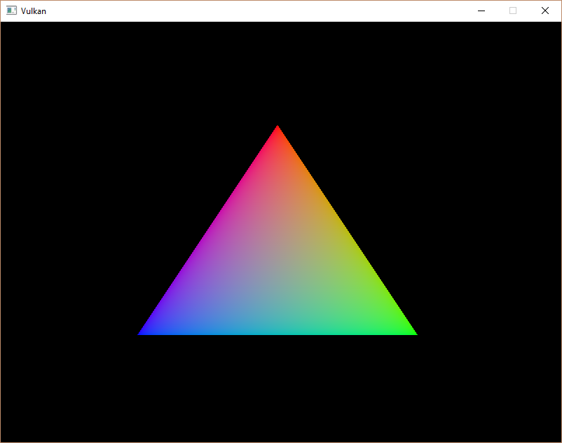
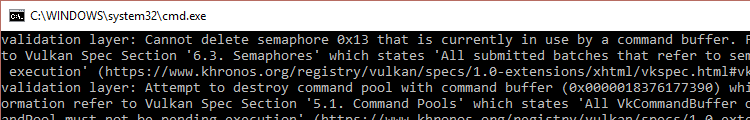

# Rendering and presentation

이 장에서는 모든 것이 결합되는 부분입니다. 우리는 메인 루프에서 호출되어 삼각형을 화면에 그릴 `drawFrame` 함수를 작성할 것입니다. 먼저 함수를 만들고 이를 `mainLoop`에서 호출합시다:

```C++
void mainLoop() {
    while (!glfwWindowShouldClose(window)) {
        glfwPollEvents();
        drawFrame();
    }
}

...

void drawFrame() {

}
```

## Outline of a frame

Vulkan에서 프레임을 렌더링하는 것은 다음과 같은 공통적인 단계들로 구성됩니다:

- 이전 프레임이 끝날 때까지 기다립니다.
- 스왑체인에서 이미지를 획득합니다.
-- 해당 이미지에 장면을 그리는 명령 버퍼를 기록합니다.
- 기록된 명령 버퍼를 제출합니다.
- 스왑체인 이미지를 표시합니다.

후속 장에서는 그리기 함수를 확장할 예정이지만, 지금은 이 부분이 우리의 렌더 루프의 핵심입니다.

## Synchronization

Vulkan의 핵심 설계 철학 중 하나는 GPU의 실행 동기화가 명시적이라는 것입니다. 작업의 순서는 우리가 정의해야 하며, 이를 위해 다양한 동기화 프리미티브를 사용하여 드라이버에 우리가 원하는 실행 순서를 알려줍니다. 이는 많은 Vulkan API 호출이 GPU에서 작업을 시작할 때 비동기적으로 실행된다는 것을 의미합니다. 함수는 작업이 완료되기 전에 반환됩니다.

이 장에서는 GPU에서 발생하는 여러 이벤트를 명시적으로 순서를 지정해야 합니다. 예를 들어:

- 스왑체인에서 이미지 획득
- 획득한 이미지에 그리기 명령 실행
- 해당 이미지를 화면에 표시하고 스왑체인에 반환

각각의 이벤트는 단일 함수 호출로 시작되지만, 모두 비동기적으로 실행됩니다. 함수 호출은 작업이 실제로 완료되기 전에 반환되며, 실행 순서도 정의되지 않습니다. 이는 불행하게도 각 작업이 이전 작업이 끝난 후에 실행되어야 하므로, 원하는 순서를 보장하기 위해 어떤 프리미티브를 사용할 수 있을지 탐구할 필요가 있습니다.

### Semaphores

세마포어는 큐 작업 간의 순서를 추가하는 데 사용됩니다. 큐 작업은 우리가 큐에 제출하는 작업을 의미하며, 명령 버퍼 또는 함수 내에서 실행될 수 있습니다. 큐의 예로는 그래픽스 큐와 프레젠테이션 큐가 있습니다. 세마포어는 동일한 큐 내에서 작업 간의 순서를 지정하거나 서로 다른 큐 간에 순서를 지정하는 데 사용됩니다.

Vulkan에는 이진 세마포어와 타임라인 세마포어 두 가지가 있습니다. 이 튜토리얼에서는 이진 세마포어만 사용할 것이므로 타임라인 세마포어에 대해서는 다루지 않습니다. 이후 "세마포어"라는 용어는 이진 세마포어만을 의미합니다.

세마포어는 신호되지 않거나 신호된 상태로 존재합니다. 처음에는 신호되지 않은 상태로 시작합니다. 큐 작업 간의 순서를 지정하는 방법은 하나의 큐 작업에서 동일한 세마포어를 '신호' 세마포어로 제공하고, 다른 큐 작업에서 그 세마포어를 '대기' 세마포어로 제공하는 것입니다. 예를 들어, 세마포어 S와 큐 작업 A, B가 있다고 가정했을 때, 우리가 Vulkan에 제공하는 내용은 작업 A가 실행을 마친 후 세마포어 S를 '신호'하고, 작업 B는 실행을 시작하기 전에 세마포어 S에서 '대기'하도록 하는 것입니다. 작업 A가 끝나면 세마포어 S가 신호되며, 작업 B는 S가 신호될 때까지 실행을 시작하지 않습니다. 작업 B가 실행되기 시작하면 세마포어 S는 자동으로 리셋되어 신호되지 않은 상태로 돌아가며, 다시 사용할 수 있게 됩니다.

다음은 방금 설명한 내용을 나타내는 의사 코드입니다:

```C++
VkCommandBuffer A, B = ... // record command buffers
VkSemaphore S = ... // create a semaphore

// enqueue A, signal S when done - starts executing immediately
vkQueueSubmit(work: A, signal: S, wait: None)

// enqueue B, wait on S to start
vkQueueSubmit(work: B, signal: None, wait: S)
```

이 코드에서 `vkQueueSubmit()` 함수 호출은 즉시 반환됩니다. 대기는 GPU에서만 발생하며, CPU는 블로킹 없이 계속 실행됩니다. CPU를 대기하게 하려면 다른 동기화 프리미티브가 필요하며, 이는 이제 설명할 것입니다.

### Fences

펜스는 유사한 목적을 가지고 있으며, 실행을 동기화하는 데 사용됩니다. 그러나 펜스는 CPU에서의 실행 순서를 지정하는 데 사용되며, 이를 호스트라고도 합니다. 간단히 말하면, 호스트가 GPU가 작업을 완료했는지 알아야 할 때 펜스를 사용합니다.

세마포어와 비슷하게, 펜스도 신호된 상태나 신호되지 않은 상태로 존재합니다. 작업을 실행하도록 제출할 때 그 작업에 펜스를 첨부할 수 있습니다. 작업이 완료되면 펜스가 신호됩니다. 그런 다음 호스트는 펜스가 신호될 때까지 기다리도록 할 수 있으며, 이로 인해 작업이 완료된 후 호스트가 계속 진행되도록 보장할 수 있습니다.

구체적인 예로는 스크린샷을 찍는 상황이 있습니다. 이미 GPU에서 필요한 작업을 완료했다고 가정합니다. 이제 GPU에서 호스트로 이미지를 전송하고 그 후 파일에 메모리를 저장해야 합니다. 여기에는 전송 작업을 실행하는 명령 버퍼 A와 펜스 F가 있습니다. 우리는 명령 버퍼 A를 펜스 F와 함께 제출한 후 즉시 호스트에게 F가 신호될 때까지 기다리도록 지시합니다. 이로 인해 호스트는 명령 버퍼 A가 실행을 마칠 때까지 블로킹되며, 작업이 완료된 후 안전하게 파일을 디스크에 저장할 수 있습니다.

설명한 내용을 나타내는 의사 코드:

```C++
VkCommandBuffer A = ... // record command buffer with the transfer
VkFence F = ... // create the fence

// enqueue A, start work immediately, signal F when done
vkQueueSubmit(work: A, fence: F)

vkWaitForFence(F) // blocks execution until A has finished executing

save_screenshot_to_disk() // can't run until the transfer has finished
```

세마포어 예시와 달리, 이 예시는 호스트 실행을 차단합니다. 즉, 실행이 완료될 때까지 호스트는 아무 작업도 하지 않고 기다립니다. 이 경우, 스크린샷을 디스크에 저장하기 전에 전송이 완료되었는지 확인해야 했습니다.

일반적으로 호스트를 차단하는 것은 필요할 때만 해야 합니다. GPU와 호스트 모두에게 유용한 작업을 제공하는 것이 좋습니다. 펜스가 신호를 받을 때까지 기다리는 것은 유용한 작업이 아닙니다. 따라서 작업을 동기화할 때는 세마포어나 아직 다루지 않은 다른 동기화 원시를 선호합니다.

펜스는 수동으로 재설정해야 신호되지 않은 상태로 되돌릴 수 있습니다. 이는 펜스가 호스트의 실행을 제어하는 데 사용되기 때문이며, 호스트가 언제 펜스를 재설정할지 결정합니다. 세마포어와는 달리, 세마포어는 GPU에서의 작업 순서를 지정하는 데 사용되며, 호스트는 관여하지 않습니다.

요약하자면, 세마포어는 GPU에서 작업의 실행 순서를 지정하는 데 사용되고, 펜스는 CPU와 GPU가 서로 동기화되도록 하는 데 사용됩니다.

### What to choose?

우리는 두 개의 동기화 원시를 사용해야 하며, 편리하게도 두 곳에서 동기화를 적용해야 합니다: Swapchain 작업과 이전 프레임이 끝날 때까지 기다리기. 우리는 swapchain 작업에 세마포어를 사용하려고 합니다. 이 작업은 GPU에서 일어나므로, 가능하면 호스트가 기다리도록 하지 않기 위해 세마포어를 사용합니다. 반면, 이전 프레임이 끝날 때까지 기다리려면 펜스를 사용해야 합니다. 그 이유는 호스트가 기다려야 하기 때문입니다. 이렇게 해야 한 번에 하나의 프레임만 그리게 됩니다. 매 프레임마다 명령 버퍼를 다시 기록하므로, 현재 프레임이 실행을 끝낼 때까지는 다음 프레임 작업을 명령 버퍼에 기록할 수 없습니다. GPU가 명령 버퍼를 사용하는 동안 버퍼의 내용을 덮어쓰지 않으려는 것이죠.

## Creating the synchronization objects

우리는 swapchain에서 이미지를 획득하여 렌더링할 준비가 되었음을 알리는 세마포어 하나, 렌더링이 완료되어 프레젠테이션이 가능하다는 것을 알리는 세마포어 하나, 그리고 한 번에 하나의 프레임만 렌더링되도록 보장하는 펜스 하나가 필요합니다.

이 세 개의 세마포어 객체와 펜스 객체를 저장할 클래스 멤버를 생성합니다.

```C++
VkSemaphore imageAvailableSemaphore;
VkSemaphore renderFinishedSemaphore;
VkFence inFlightFence;
```

세마포어를 생성하기 위해, 이번 튜토리얼의 마지막 생성 함수인 `createSyncObjects`를 추가합니다.

```C++
void initVulkan() {
    createInstance();
    setupDebugMessenger();
    createSurface();
    pickPhysicalDevice();
    createLogicalDevice();
    createSwapChain();
    createImageViews();
    createRenderPass();
    createGraphicsPipeline();
    createFramebuffers();
    createCommandPool();
    createCommandBuffer();
    createSyncObjects();
}

...

void createSyncObjects() {

}
```

세마포어를 생성하려면 `VkSemaphoreCreateInfo`를 채워야 하지만, 현재 버전의 API에서는 sType을 제외한 필수 필드는 없습니다.

```C++
void createSyncObjects() {
    VkSemaphoreCreateInfo semaphoreInfo{};
    semaphoreInfo.sType = VK_STRUCTURE_TYPE_SEMAPHORE_CREATE_INFO;
}
```

향후 Vulkan API 버전이나 확장에서는 다른 구조체와 마찬가지로 `flags`와 `pNext` 매개변수에 대한 기능이 추가될 수 있습니다.

펜스를 생성하려면 `VkFenceCreateInfo`를 채워야 합니다.

```C++
VkFenceCreateInfo fenceInfo{};
fenceInfo.sType = VK_STRUCTURE_TYPE_FENCE_CREATE_INFO;
```

세마포어와 펜스를 생성하는 것은 `vkCreateSemaphore`와 `vkCreateFence`를 사용하여 익숙한 패턴을 따릅니다.

```C++
if (vkCreateSemaphore(device, &semaphoreInfo, nullptr, &imageAvailableSemaphore) != VK_SUCCESS ||
    vkCreateSemaphore(device, &semaphoreInfo, nullptr, &renderFinishedSemaphore) != VK_SUCCESS ||
    vkCreateFence(device, &fenceInfo, nullptr, &inFlightFence) != VK_SUCCESS) {
    throw std::runtime_error("failed to create semaphores!");
}
```

세마포어와 펜스는 프로그램이 끝날 때, 모든 명령이 완료되고 더 이상 동기화가 필요하지 않을 때 정리해야 합니다.

```C++
void cleanup() {
    vkDestroySemaphore(device, imageAvailableSemaphore, nullptr);
    vkDestroySemaphore(device, renderFinishedSemaphore, nullptr);
    vkDestroyFence(device, inFlightFence, nullptr);
```

이제 본격적으로 그리기 함수로 넘어갑니다!

## Waiting for the previous frame

프레임의 시작 시, 우리는 이전 프레임이 끝날 때까지 기다려야 합니다. 이렇게 해야 명령 버퍼와 세마포어를 사용할 수 있기 때문입니다. 이를 위해 `vkWaitForFences`를 호출합니다:

```C++
void drawFrame() {
    vkWaitForFences(device, 1, &inFlightFence, VK_TRUE, UINT64_MAX);
}
```

`vkWaitForFences` 함수는 펜스 배열을 받아 호스트에서 펜스가 신호(signaled) 상태가 될 때까지 대기합니다. 여기서 전달하는 `VK_TRUE`는 모든 펜스에 대해 대기할 것임을 나타냅니다. 만약 펜스가 하나일 경우, 그 값은 중요하지 않습니다. 이 함수는 또한 타임아웃 매개변수를 가지며, 우리는 이를 `UINT64_MAX`로 설정하여 타임아웃을 실질적으로 비활성화합니다.

대기 후에는 `vkResetFences` 호출을 통해 펜스를 신호되지 않음(unsignaled) 상태로 수동으로 리셋해야 합니다.

```C++
vkResetFences(device, 1, &inFlightFence);
```

하지만 진행하기 전에, 설계에서 약간의 문제가 있습니다. 첫 번째 프레임에서는 `drawFrame()`을 호출하며, 이 함수는 즉시 `inFlightFence`가 신호 상태로 될 때까지 기다립니다. 그러나 `inFlightFence`는 프레임이 렌더링을 완료한 후에만 신호가 발생하는데, 첫 번째 프레임에서는 신호가 발생할 이전 프레임이 없으므로 `vkWaitForFences()`가 무기한 블록되어 기다리게 됩니다.

이 문제를 해결할 수 있는 여러 방법 중, API에 내장된 기발한 우회 방법이 있습니다. 펜스를 생성할 때 이미 신호 상태로 설정하면, 첫 번째 `vkWaitForFences()` 호출이 즉시 반환되므로 문제가 해결됩니다.

이를 위해 `VkFenceCreateInfo`에 `VK_FENCE_CREATE_SIGNALED_BIT` 플래그를 추가합니다:

```C++
void createSyncObjects() {
    ...

    VkFenceCreateInfo fenceInfo{};
    fenceInfo.sType = VK_STRUCTURE_TYPE_FENCE_CREATE_INFO;
    fenceInfo.flags = VK_FENCE_CREATE_SIGNALED_BIT;

    ...
}
```

## Acquiring an image from the swap chain

`drawFrame` 함수에서 해야 할 다음 작업은 스왑 체인에서 이미지를 획득하는 것입니다. 스왑 체인은 확장 기능이므로, `vk*KHR` 네이밍 규칙을 따르는 함수를 사용해야 합니다:

```C++
void drawFrame() {
    uint32_t imageIndex;
    vkAcquireNextImageKHR(device, swapChain, UINT64_MAX, imageAvailableSemaphore, VK_NULL_HANDLE, &imageIndex);
}
```

`vkAcquireNextImageKHR` 함수의 첫 번째와 두 번째 매개변수는 논리 디바이스와 이미지를 획득하려는 스왑 체인입니다. 세 번째 매개변수는 이미지가 사용 가능해지기를 기다리는 시간(나노초 단위)을 지정합니다. 64비트 부호 없는 정수의 최대 값을 사용하면 사실상 타임아웃을 비활성화할 수 있습니다.

다음 두 매개변수는 프레젠테이션 엔진이 이미지를 다 사용한 후 신호를 보낼 동기화 객체를 지정합니다. 그 시점에서 우리는 이미지를 그리기 시작할 수 있습니다. 세마포어, 펜스 또는 둘 다를 지정할 수 있습니다. 여기서는 `imageAvailableSemaphore`를 사용할 것입니다.

마지막 매개변수는 사용 가능한 스왑 체인 이미지의 인덱스를 출력할 변수입니다. 이 인덱스는 `swapChainImages` 배열에서 해당 `VkImage`를 가리킵니다. 우리는 이 인덱스를 사용하여 `VkFrameBuffer`를 선택할 것입니다.

## Recording the command buffer

imageIndex가 사용될 스왑 체인 이미지를 지정하고 나면, 이제 명령 버퍼를 기록할 수 있습니다. 먼저, `vkResetCommandBuffer`를 호출하여 명령 버퍼가 다시 기록 가능하도록 만듭니다.

```C++
vkResetCommandBuffer(commandBuffer, 0);
```

`vkResetCommandBuffer`의 두 번째 매개변수는 `VkCommandBufferResetFlagBits` 플래그입니다. 특별한 작업을 하고 싶지 않으므로, 이를 0으로 설정합니다.

이제 `recordCommandBuffer` 함수를 호출하여 우리가 원하는 명령들을 기록합니다.

```C++
recordCommandBuffer(commandBuffer, imageIndex);
```

완전히 기록된 명령 버퍼가 준비되었으므로, 이제 이를 제출할 수 있습니다.

## Submitting the command buffer

큐 제출과 동기화는 `VkSubmitInfo` 구조체의 매개변수를 통해 설정됩니다.

```C++
VkSubmitInfo submitInfo{};
submitInfo.sType = VK_STRUCTURE_TYPE_SUBMIT_INFO;

VkSemaphore waitSemaphores[] = {imageAvailableSemaphore};
VkPipelineStageFlags waitStages[] = {VK_PIPELINE_STAGE_COLOR_ATTACHMENT_OUTPUT_BIT};
submitInfo.waitSemaphoreCount = 1;
submitInfo.pWaitSemaphores = waitSemaphores;
submitInfo.pWaitDstStageMask = waitStages;
```

첫 세 개의 매개변수는 실행이 시작되기 전에 대기할 세마포어와 대기할 파이프라인 단계들을 지정합니다. 우리는 이미지가 사용 가능할 때까지 색상 쓰기를 대기하고 싶으므로, 색상 첨부에 쓰는 그래픽스 파이프라인 단계를 지정합니다. 즉, 이론적으로 구현은 이미지가 아직 준비되지 않았더라도 이미 버텍스 셰이더 등의 실행을 시작할 수 있습니다. `waitStages` 배열의 각 항목은 `pWaitSemaphores`에서 같은 인덱스에 해당하는 세마포어와 일치합니다.

```C++
submitInfo.commandBufferCount = 1;
submitInfo.pCommandBuffers = &commandBuffer;
```

다음 두 매개변수는 실제로 실행할 명령 버퍼를 지정합니다. 우리는 단일 명령 버퍼만 제출합니다.

```C++
VkSemaphore signalSemaphores[] = {renderFinishedSemaphore};
submitInfo.signalSemaphoreCount = 1;
submitInfo.pSignalSemaphores = signalSemaphores;
```

`signalSemaphoreCount`와 `pSignalSemaphores` 매개변수는 명령 버퍼 실행이 완료된 후 신호를 보낼 세마포어를 지정합니다. 여기서는 `renderFinishedSemaphore`를 사용합니다.

```C++
if (vkQueueSubmit(graphicsQueue, 1, &submitInfo, inFlightFence) != VK_SUCCESS) {
    throw std::runtime_error("failed to submit draw command buffer!");
}
```

이제 `vkQueueSubmit`을 사용하여 명령 버퍼를 그래픽 큐에 제출할 수 있습니다. 이 함수는 워크로드가 더 클 경우 효율성을 위해 여러 `VkSubmitInfo` 구조체 배열을 인수로 받습니다. 마지막 매개변수는 명령 버퍼가 완료될 때 신호를 보낼 선택적 펜스를 참조합니다. 이를 통해 명령 버퍼가 재사용되기 전에 완료되었는지 확인할 수 있습니다. 따라서 우리는 `inFlightFence`를 제공합니다. 이제 다음 프레임에서 CPU는 이 명령 버퍼가 실행을 완료할 때까지 대기한 후 새 명령을 기록할 수 있습니다.

## Subpass dependencies

렌더 패스의 서브패스는 자동으로 이미지 레이아웃 전환을 처리합니다. 이러한 전환은 서브패스 간의 메모리 및 실행 의존성을 지정하는 서브패스 의존성에 의해 제어됩니다. 현재 우리는 단일 서브패스만 사용하고 있지만, 이 서브패스 전후의 작업도 암묵적인 "서브패스(Subpass)"로 간주됩니다.

렌더 패스의 시작과 끝에서 자동으로 전환을 처리하는 두 가지 내장 의존성이 있지만, 첫 번째 의존성은 적절한 시점에서 발생하지 않습니다. 이 의존성은 파이프라인 시작 시점에 전환이 발생한다고 가정하지만, 그 시점에서는 이미지를 아직 획득하지 않았기 때문입니다! 이 문제를 해결하는 두 가지 방법이 있습니다. 하나는 `imageAvailableSemaphore`의 `waitStages`를 `VK_PIPELINE_STAGE_TOP_OF_PIPE_BIT`로 변경하여 렌더 패스가 이미지를 사용할 수 있을 때까지 시작되지 않도록 하는 방법이고, 다른 하나는 렌더 패스가 `VK_PIPELINE_STAGE_COLOR_ATTACHMENT_OUTPUT_BIT` 단계에서 대기하도록 만드는 방법입니다. 저는 두 번째 옵션을 선택했습니다. 왜냐하면 이 방법이 서브패스 의존성에 대해 살펴볼 좋은 기회를 제공하기 때문입니다.

서브패스 의존성은 `VkSubpassDependency` 구조체에서 지정됩니다. `createRenderPass` 함수로 가서 하나를 추가해보세요.

```C++
VkSubpassDependency dependency{};
dependency.srcSubpass = VK_SUBPASS_EXTERNAL;
dependency.dstSubpass = 0;
```

첫 번째 두 필드는 의존성과 의존하는 서브패스의 인덱스를 지정합니다. 특수 값 `VK_SUBPASS_EXTERNAL`은 렌더 패스 전후의 암묵적인 서브패스를 나타내며, 이는 `srcSubpass`나 `dstSubpass`에 지정된 위치에 따라 다릅니다. 인덱스 0은 우리의 서브패스를 나타내며, 이는 첫 번째이자 유일한 서브패스입니다. `dstSubpass`는 항상 `srcSubpass`보다 커야 의존성 그래프에서 사이클이 발생하지 않도록 해야 합니다(단, 서브패스 중 하나가 `VK_SUBPASS_EXTERNAL`인 경우는 예외입니다).

```C++
dependency.srcStageMask = VK_PIPELINE_STAGE_COLOR_ATTACHMENT_OUTPUT_BIT;
dependency.srcAccessMask = 0;
```

다음 두 필드는 대기할 작업과 이 작업이 발생하는 파이프라인 단계를 지정합니다. 우리는 이미지를 접근하기 전에 스왑 체인이 이미지를 읽는 작업이 끝나기를 기다려야 합니다. 이는 색상 첨부 출력 단계에서 대기함으로써 해결할 수 있습니다.

```C++
dependency.dstStageMask = VK_PIPELINE_STAGE_COLOR_ATTACHMENT_OUTPUT_BIT;
dependency.dstAccessMask = VK_ACCESS_COLOR_ATTACHMENT_WRITE_BIT;
```

대기해야 하는 작업은 색상 첨부 단계에 있으며, 이는 색상 첨부를 쓰는 작업입니다. 이 설정은 실제로 필요하고 허용된 시점에서만 전환이 발생하도록 방지합니다: 즉, 색상을 쓰기 시작할 때입니다.

```C++
renderPassInfo.dependencyCount = 1;
renderPassInfo.pDependencies = &dependency;
```

`VkRenderPassCreateInfo` 구조체에는 의존성 배열을 지정하는 두 개의 필드가 있습니다.

## Presentation

프레임을 그린 후 마지막 단계는 결과를 스왑 체인에 제출하여 화면에 표시되도록 하는 것입니다. 프레젠테이션은 `VkPresentInfoKHR` 구조체를 통해 설정되며, 이는 `drawFrame` 함수의 마지막에서 처리됩니다.

```C++
VkPresentInfoKHR presentInfo{};
presentInfo.sType = VK_STRUCTURE_TYPE_PRESENT_INFO_KHR;

presentInfo.waitSemaphoreCount = 1;
presentInfo.pWaitSemaphores = signalSemaphores;
```

첫 번째 두 파라미터는 프레젠테이션이 발생하기 전에 대기할 세마포어를 지정합니다. 이는 `VkSubmitInfo`와 유사합니다. 우리는 명령 버퍼가 실행을 마칠 때까지 대기해야 하므로, 즉 삼각형이 그려지도록 세마포어가 신호를 보내면 이를 대기합니다. 따라서 우리는 `signalSemaphores`를 사용합니다.

```C++
VkSwapchainKHR swapChains[] = {swapChain};
presentInfo.swapchainCount = 1;
presentInfo.pSwapchains = swapChains;
presentInfo.pImageIndices = &imageIndex;
```

다음 두 파라미터는 이미지를 표시할 스왑 체인과 각 스왑 체인에 대한 이미지 인덱스를 지정합니다. 대부분의 경우 이는 단일 스왑 체인일 것입니다.

```C++
presentInfo.pResults = nullptr; // Optional
```

마지막으로 선택적인 파라미터인 `pResults`가 있습니다. 이는 각 개별 스왑 체인에 대해 프레젠테이션이 성공했는지 여부를 확인하기 위해 `VkResult` 값 배열을 지정할 수 있게 해줍니다. 단일 스왑 체인만 사용하는 경우에는 필요하지 않습니다. 왜냐하면 present 함수의 반환 값을 사용하면 되기 때문입니다.

```C++
vkQueuePresentKHR(presentQueue, &presentInfo);
```

`vkQueuePresentKHR` 함수는 이미지를 스왑 체인에 표시하라는 요청을 제출합니다. `vkAcquireNextImageKHR`와 `vkQueuePresentKHR` 모두에 대한 오류 처리는 다음 장에서 다룰 예정입니다. 그 실패가 반드시 프로그램 종료를 의미하지 않기 때문입니다. 

지금까지 모든 작업을 제대로 했다면, 프로그램을 실행하면 아래와 유사한 결과를 확인할 수 있을 것입니다.



> 이 색이 입혀진 삼각형은 그래픽 튜토리얼에서 자주 보는 것과 조금 다를 수 있습니다. 그 이유는 이 튜토리얼이 쉐이더에서 선형 색 공간(linear color space)으로 보간(interpolate)하고 나서 이후에 sRGB 색 공간으로 변환하기 때문입니다. 차이에 대한 논의는 [이 블로그 포스트](https://medium.com/@heypete/hello-triangle-meet-swift-and-wide-color-6f9e246616d9)에서 확인할 수 있습니다.

오, 좋아요! 하지만 안타깝게도 검증 레이어(validation layers)가 활성화된 상태에서 프로그램을 종료하면 바로 크래시가 발생하는 것을 볼 수 있습니다. 디버그 콜백(`debugCallback`)에서 터미널에 출력된 메시지가 그 이유를 알려줍니다:



맞습니다! `drawFrame`의 모든 작업은 비동기적(`asynchronous`)입니다. 즉, `mainLoop`에서 루프를 종료할 때 그리기와 프레젠테이션 작업이 여전히 진행 중일 수 있습니다. 이러한 작업이 진행 중인 상태에서 자원을 정리하는 것은 문제가 될 수 있습니다.

이 문제를 해결하기 위해, `mainLoop`를 종료하고 창을 삭제하기 전에 논리적 장치가 작업을 완료할 때까지 기다려야 합니다.

```C++
void mainLoop() {
    while (!glfwWindowShouldClose(window)) {
        glfwPollEvents();
        drawFrame();
    }

    vkDeviceWaitIdle(device);
}
```

또한 `vkQueueWaitIdle`을 사용하여 특정 명령 큐의 작업이 완료될 때까지 기다릴 수도 있습니다. 이러한 함수들은 매우 기본적인 방식으로 동기화를 수행하는 데 사용될 수 있습니다. 이렇게 수정한 후 프로그램을 종료할 때 더 이상 문제가 발생하지 않음을 확인할 수 있습니다.

## Conclusion

맞습니다! 900줄이 넘는 코드 끝에 드디어 화면에 무언가가 나타나는 걸 볼 수 있게 되었군요! Vulkan 프로그램을 처음 시작하는 것은 확실히 많은 작업이 필요하지만, 그 핵심적인 메시지는 Vulkan이 제공하는 명확성 덕분에 엄청난 제어 능력을 가진다는 점입니다. 지금 이 코드를 다시 읽고 각 Vulkan 객체들이 프로그램에서 어떤 역할을 하고 서로 어떻게 관계가 있는지에 대해 머릿속으로 모델을 세우는 시간을 갖는 것이 중요합니다. 이후에는 이 지식을 바탕으로 프로그램의 기능을 확장해 나갈 예정입니다.

다음 장에서는 여러 프레임을 동시에 처리할 수 있도록 렌더 루프를 확장할 예정입니다.

## Source code
- [C++ code](https://vulkan-tutorial.com/code/15_hello_triangle.cpp)
- [Vertex shader](https://vulkan-tutorial.com/code/09_shader_base.vert)
- [Fragment shader](https://vulkan-tutorial.com/code/09_shader_base.frag)