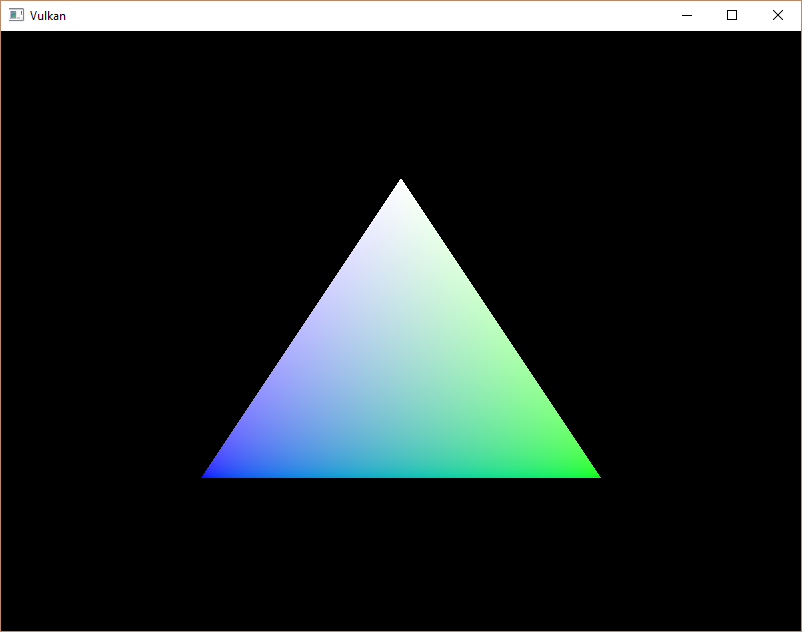

# Vertex buffer creation

## Introduction

Vulkan에서 버퍼는 그래픽 카드가 읽을 수 있는 임의의 데이터를 저장하기 위한 메모리 영역입니다. 이번 챕터에서는 정점 데이터를 저장하기 위해 사용하지만, 이후 챕터에서 탐구할 다양한 용도로도 사용할 수 있습니다. 지금까지 다뤄온 Vulkan 객체들과는 달리, 버퍼는 메모리를 자동으로 할당하지 않습니다. 이전 챕터에서 다뤘듯이, Vulkan API는 거의 모든 것을 프로그래머가 제어하도록 설계되었으며, 메모리 관리도 그중 하나입니다.

## Buffer creation

새로운 함수 `createVertexBuffer`를 생성하고, `initVulkan`에서 `createCommandBuffers`를 호출하기 직전에 호출하세요.

```C++
void initVulkan() {
    createInstance();
    setupDebugMessenger();
    createSurface();
    pickPhysicalDevice();
    createLogicalDevice();
    createSwapChain();
    createImageViews();
    createRenderPass();
    createGraphicsPipeline();
    createFramebuffers();
    createCommandPool();
    createVertexBuffer();
    createCommandBuffers();
    createSyncObjects();
}

...

void createVertexBuffer() {

}
```

버퍼를 생성하려면 `VkBufferCreateInfo` 구조체를 채워야 합니다.

```C++
VkBufferCreateInfo bufferInfo{};
bufferInfo.sType = VK_STRUCTURE_TYPE_BUFFER_CREATE_INFO;
bufferInfo.size = sizeof(vertices[0]) * vertices.size();
```

구조체의 첫 번째 필드인 `size`는 버퍼의 크기를 바이트 단위로 지정합니다. 정점 데이터의 바이트 크기는 `sizeof`를 사용해 간단히 계산할 수 있습니다.

```C++
bufferInfo.usage = VK_BUFFER_USAGE_VERTEX_BUFFER_BIT;
```

두 번째 필드인 `usage`는 버퍼의 데이터가 어떤 목적으로 사용될지를 나타냅니다. 비트 연산자 OR(|)를 사용해 여러 목적을 지정할 수도 있습니다. 이번에는 정점 버퍼로 사용할 예정이며, 다른 용도는 이후 챕터에서 다룰 것입니다.

```C++
bufferInfo.sharingMode = VK_SHARING_MODE_EXCLUSIVE;
```

스왑체인의 이미지와 마찬가지로 버퍼도 특정 큐 패밀리가 소유하거나 여러 큐 패밀리 간에 공유될 수 있습니다. 이번 경우에는 그래픽 큐에서만 사용되므로 독점 액세스(exclusive access)로 설정하면 됩니다.

`flags` 매개변수는 희소 버퍼 메모리(sparse buffer memory)를 설정하는 데 사용되지만, 현재는 관련이 없으므로 기본값인 `0`으로 설정합니다.

이제 `vkCreateBuffer`를 사용해 버퍼를 생성할 수 있습니다. 버퍼 핸들을 저장할 클래스 멤버를 정의하고, 이를 `vertexBuffer`라고 명명하세요.

```C++
VkBuffer vertexBuffer;

...

void createVertexBuffer() {
    VkBufferCreateInfo bufferInfo{};
    bufferInfo.sType = VK_STRUCTURE_TYPE_BUFFER_CREATE_INFO;
    bufferInfo.size = sizeof(vertices[0]) * vertices.size();
    bufferInfo.usage = VK_BUFFER_USAGE_VERTEX_BUFFER_BIT;
    bufferInfo.sharingMode = VK_SHARING_MODE_EXCLUSIVE;

    if (vkCreateBuffer(device, &bufferInfo, nullptr, &vertexBuffer) != VK_SUCCESS) {
        throw std::runtime_error("failed to create vertex buffer!");
    }
}
```

버퍼는 프로그램 종료 시까지 렌더링 명령에서 사용할 수 있어야 하며, 스왑 체인에 의존하지 않으므로 원래의 정리 함수(`cleanup`)에서 정리합니다.

```C++
void cleanup() {
    cleanupSwapChain();

    vkDestroyBuffer(device, vertexBuffer, nullptr);

    ...
}
```

## Memory requirements

버퍼가 생성되었지만 아직 메모리가 할당되지 않았습니다. 버퍼에 대한 메모리를 할당하는 첫 번째 단계는 적절하게 명명된 `vkGetBufferMemoryRequirements` 함수를 사용하여 메모리 요구 사항을 쿼리하는 것입니다.

```C++
VkMemoryRequirements memRequirements;
vkGetBufferMemoryRequirements(device, vertexBuffer, &memRequirements);
```

`VkMemoryRequirements` 구조체는 세 가지 필드를 가지고 있습니다:

- `size`: 필요한 메모리의 크기(바이트 단위)로, bufferInfo.size와 다를 수 있습니다.
- `alignment`: 할당된 메모리 영역에서 버퍼가 시작되는 바이트 오프셋으로, `bufferInfo.usage`와 `bufferInfo.flags`에 따라 달라집니다.
- `memoryTypeBits`: 버퍼에 적합한 메모리 유형의 비트 필드입니다.

그래픽 카드에서는 여러 종류의 메모리를 할당할 수 있습니다. 각 메모리 유형은 허용된 작업과 성능 특성에 따라 다릅니다. 우리는 버퍼의 요구 사항과 애플리케이션의 요구 사항을 결합하여 적합한 메모리 유형을 찾아야 합니다. 이를 위해 새로운 함수 `findMemoryType`을 생성합니다.

```C++
uint32_t findMemoryType(uint32_t typeFilter, VkMemoryPropertyFlags properties) {

}
```

먼저, `vkGetPhysicalDeviceMemoryProperties`를 사용하여 사용 가능한 메모리 유형에 대한 정보를 쿼리해야 합니다.

```C++
VkPhysicalDeviceMemoryProperties memProperties;
vkGetPhysicalDeviceMemoryProperties(physicalDevice, &memProperties);
```

`VkPhysicalDeviceMemoryProperties` 구조체에는 `memoryTypes`와 `memoryHeaps`라는 두 개의 배열이 있습니다. 메모리 힙은 VRAM과 같은 전용 VRAM 또는 VRAM이 부족할 때 사용할 수 있는 RAM의 교체 공간과 같은 구별된 메모리 리소스입니다. 다양한 메모리 유형은 이러한 힙 내에 존재합니다. 지금은 메모리 유형에만 관심이 있으며, 힙은 어떤 영향을 미칠 수 있다는 점을 고려할 수 있습니다.

먼저 버퍼에 적합한 메모리 유형을 찾아봅시다.

```C++
for (uint32_t i = 0; i < memProperties.memoryTypeCount; i++) {
    if (typeFilter & (1 << i)) {
        return i;
    }
}

throw std::runtime_error("failed to find suitable memory type!");
```

`typeFilter` 매개변수는 적합한 메모리 유형의 비트 필드를 지정하는 데 사용됩니다. 이는 적합한 메모리 유형의 인덱스를 찾기 위해 해당 비트가 `1`로 설정되어 있는지 확인하면서 반복하면 된다는 의미입니다.

그러나 우리는 단순히 버퍼에 적합한 메모리 유형에만 관심이 있는 것이 아닙니다. 그 메모리에 우리가 버텍스 데이터를 쓸 수 있어야 합니다. `memoryTypes` 배열은 각 메모리 유형의 힙과 속성을 지정하는 `VkMemoryType` 구조체들로 구성됩니다. 속성은 메모리를 맵핑하여 CPU에서 쓸 수 있도록 하는 등의 메모리의 특별한 기능을 정의합니다. 이 속성은 `VK_MEMORY_PROPERTY_HOST_VISIBLE_BIT`로 표시되지만, `VK_MEMORY_PROPERTY_HOST_COHERENT_BIT` 속성도 사용해야 합니다. 메모리를 맵핑할 때 이유를 알게 될 것입니다.

이제 루프를 수정하여 이 속성의 지원 여부도 확인할 수 있습니다.

```C++
for (uint32_t i = 0; i < memProperties.memoryTypeCount; i++) {
    if ((typeFilter & (1 << i)) && (memProperties.memoryTypes[i].propertyFlags & properties) == properties) {
        return i;
    }
}
```

우리는 원하는 속성이 여러 개일 수 있으므로 비트 단위 AND 결과가 단지 0이 아닌 값이 아니라 원하는 속성의 비트 필드와 일치하는지 확인해야 합니다. 버퍼에 적합한 메모리 유형이 있으며 그 메모리 유형이 필요한 모든 속성을 지원한다면 해당 인덱스를 반환하고, 그렇지 않으면 예외를 던집니다.

## Memory allocation

이제 올바른 메모리 유형을 결정할 수 있는 방법이 생겼으므로 실제로 메모리를 할당할 수 있습니다. 이를 위해 `VkMemoryAllocateInfo` 구조체를 채웁니다.

```C++
VkMemoryAllocateInfo allocInfo{};
allocInfo.sType = VK_STRUCTURE_TYPE_MEMORY_ALLOCATE_INFO;
allocInfo.allocationSize = memRequirements.size;
allocInfo.memoryTypeIndex = findMemoryType(memRequirements.memoryTypeBits, VK_MEMORY_PROPERTY_HOST_VISIBLE_BIT | VK_MEMORY_PROPERTY_HOST_COHERENT_BIT);
```

메모리 할당은 이제 크기와 유형을 지정하는 것으로 매우 간단해졌습니다. 두 값 모두 버텍스 버퍼의 메모리 요구 사항과 원하는 속성에서 파생됩니다. 메모리 핸들을 저장할 클래스 멤버를 생성하고 `vkAllocateMemory`로 할당합니다.

```C++
VkBuffer vertexBuffer;
VkDeviceMemory vertexBufferMemory;

...

if (vkAllocateMemory(device, &allocInfo, nullptr, &vertexBufferMemory) != VK_SUCCESS) {
    throw std::runtime_error("failed to allocate vertex buffer memory!");
}
```

메모리 할당이 성공하면 이제 `vkBindBufferMemory`를 사용하여 이 메모리를 버퍼와 연결할 수 있습니다:

```C++
vkBindBufferMemory(device, vertexBuffer, vertexBufferMemory, 0);
```

첫 세 개의 매개변수는 자명하고 네 번째 매개변수는 메모리 영역 내에서의 오프셋입니다. 이 메모리는 버텍스 버퍼에 특별히 할당되었으므로 오프셋은 단순히 `0`입니다. 오프셋이 0이 아닌 경우, `memRequirements.alignment`로 나누어 떨어져야 합니다.

물론 C++에서 동적 메모리 할당과 마찬가지로, 메모리는 언젠가 해제되어야 합니다. 버퍼 객체에 바인딩된 메모리는 버퍼가 더 이상 사용되지 않으면 해제할 수 있으므로, 버퍼가 삭제된 후 메모리를 해제합시다.

```C++
void cleanup() {
    cleanupSwapChain();

    vkDestroyBuffer(device, vertexBuffer, nullptr);
    vkFreeMemory(device, vertexBufferMemory, nullptr);
```

## Filling the vertex buffer

이제 버텍스 데이터를 버퍼에 복사할 차례입니다. 이는 `vkMapMemory`로 [버퍼 메모리를 CPU 접근 가능한 메모리로 맵핑](https://en.wikipedia.org/wiki/Memory-mapped_I/O_and_port-mapped_I/O)하여 수행합니다.

```C++
void* data;
vkMapMemory(device, vertexBufferMemory, 0, bufferInfo.size, 0, &data);
```

이 함수는 오프셋과 크기로 정의된 지정된 메모리 리소스의 영역에 접근할 수 있게 해줍니다. 여기서 오프셋과 크기는 각각 `0`과 `bufferInfo.size`입니다. 모든 메모리를 맵핑하려면 특별한 값 `VK_WHOLE_SIZE`를 지정할 수도 있습니다. API에서는 아직 사용할 수 있는 플래그가 없으므로 두 번째 마지막 매개변수는 `0`으로 설정해야 합니다. 마지막 매개변수는 맵핑된 메모리에 대한 포인터를 출력하기 위한 것입니다.

```C++
void* data;
vkMapMemory(device, vertexBufferMemory, 0, bufferInfo.size, 0, &data);
    memcpy(data, vertices.data(), (size_t) bufferInfo.size);
vkUnmapMemory(device, vertexBufferMemory);
```

이제 `memcpy`로 버텍스 데이터를 맵핑된 메모리에 복사하고 `vkUnmapMemory`를 사용하여 다시 언맵핑하면 됩니다. 불행히도 드라이버는 즉시 데이터를 버퍼 메모리로 복사하지 않을 수 있습니다. 예를 들어 캐시 때문에 그럴 수 있습니다. 또한 버퍼에 대한 쓰기가 맵핑된 메모리에서 즉시 보이지 않을 수도 있습니다. 이 문제를 해결할 수 있는 두 가지 방법이 있습니다:

- 호스트 일관성 메모리 힙을 사용합니다. 이는 `VK_MEMORY_PROPERTY_HOST_COHERENT_BIT`로 표시됩니다.
- 맵핑된 메모리에 데이터를 쓴 후 `vkFlushMappedMemoryRanges`를 호출하고, 맵핑된 메모리에서 데이터를 읽기 전에 `vkInvalidateMappedMemoryRanges`를 호출합니다.

우리는 첫 번째 접근 방식을 선택했습니다. 이 방식은 맵핑된 메모리가 항상 할당된 메모리의 내용을 일치시키도록 보장합니다. 이 방법은 명시적 플러시보다 성능이 약간 떨어질 수 있지만, 왜 그것이 중요하지 않은지에 대해서는 다음 챕터에서 다룰 것입니다.

메모리 범위를 플러시하거나 일관성 있는 메모리 힙을 사용하면 드라이버가 버퍼에 대한 우리의 쓰기를 인식하게 되지만, 그 쓰기가 실제로 GPU에서 보이는 것은 아닙니다. GPU로 데이터 전송은 백그라운드에서 이루어지는 작업이며, 명세는 `vkQueueSubmit`에 대한 다음 호출이 완료되었을 때 데이터 전송이 완료되었음을 보장한다고만 명시하고 있습니다.

## Binding the vertex buffer

남은 작업은 렌더링 작업 중에 정점 버퍼를 바인딩하는 것입니다. 이를 위해 `recordCommandBuffer` 함수를 확장하겠습니다.

```C++
vkCmdBindPipeline(commandBuffer, VK_PIPELINE_BIND_POINT_GRAPHICS, graphicsPipeline);

VkBuffer vertexBuffers[] = {vertexBuffer};
VkDeviceSize offsets[] = {0};
vkCmdBindVertexBuffers(commandBuffer, 0, 1, vertexBuffers, offsets);

vkCmdDraw(commandBuffer, static_cast<uint32_t>(vertices.size()), 1, 0, 0);
```

`vkCmdBindVertexBuffers` 함수는 이전 챕터에서 설정한 바인딩과 같은 정점 버퍼를 바인딩하는 데 사용됩니다. 첫 번째 두 매개변수는 명령 버퍼를 제외하고 바인딩할 정점 버퍼의 오프셋과 수를 지정합니다. 마지막 두 매개변수는 바인딩할 정점 버퍼의 배열과 정점 데이터를 읽기 시작할 바이트 오프셋을 지정합니다. 또한, `vkCmdDraw` 호출에서 하드코딩된 숫자 `3` 대신 버퍼에 있는 정점 수를 전달하도록 변경해야 합니다.

이제 프로그램을 실행하면 다시 익숙한 삼각형을 볼 수 있습니다:


`vertices` 배열에서 상단 정점의 색상을 흰색으로 변경해 보세요:

```C++
const std::vector<Vertex> vertices = {
    { { 0.0f, -0.5f}, {1.0f, 1.0f, 1.0f} },
    { { 0.5f,  0.5f}, {0.0f, 1.0f, 0.0f} },
    { {-0.5f,  0.5f}, {0.0f, 0.0f, 1.0f} }
};
```

프로그램을 다시 실행하면 다음과 같은 결과를 볼 수 있습니다.



다음 챕터에서는 더 나은 성능을 제공하지만 더 많은 작업이 필요한 정점 데이터를 정점 버퍼에 복사하는 다른 방법을 살펴보겠습니다.

## Source code
- [C++ code](https://vulkan-tutorial.com/code/19_vertex_buffer.cpp)
- [Vertex shader](https://vulkan-tutorial.com/code/18_shader_vertexbuffer.vert)
- [Fragment shader](https://vulkan-tutorial.com/code/18_shader_vertexbuffer.frag)