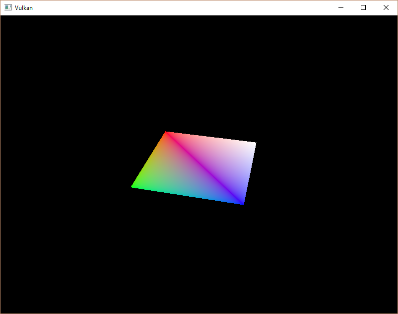

# Descriptor pool and sets

## Introduction

이전 챕터에서 설명한 디스크립터 레이아웃은 바인딩할 수 있는 디스크립터 유형을 정의합니다. 이번 챕터에서는 각각의 `VkBuffer` 리소스에 대해 디스크립터 세트를 생성하고 이를 유니폼 버퍼 디스크립터에 바인딩하는 과정을 다룹니다.

## Descriptor pool

디스크립터 세트는 직접 생성할 수 없으며, 명령 버퍼와 마찬가지로 풀에서 할당해야 합니다. 디스크립터 세트의 경우, 이러한 풀은 디스크립터 풀(descriptor pool)이라고 합니다. 디스크립터 풀을 설정하기 위해 `createDescriptorPool`이라는 새 함수를 작성할 것입니다.

```C++
void initVulkan() {
    ...
    createUniformBuffers();
    createDescriptorPool();
    ...
}

...

void createDescriptorPool() {

}
```

먼저, 디스크립터 세트에 포함될 디스크립터 유형과 그 개수를 `VkDescriptorPoolSize` 구조체를 사용하여 정의해야 합니다.

```C++
VkDescriptorPoolSize poolSize{};
poolSize.type = VK_DESCRIPTOR_TYPE_UNIFORM_BUFFER;
poolSize.descriptorCount = static_cast<uint32_t>(MAX_FRAMES_IN_FLIGHT);
```

우리는 각 프레임마다 이러한 디스크립터 중 하나를 할당할 예정입니다. 이 풀 크기 구조체는 메인 `VkDescriptorPoolCreateInfo`에 참조됩니다.

```C++
VkDescriptorPoolCreateInfo poolInfo{};
poolInfo.sType = VK_STRUCTURE_TYPE_DESCRIPTOR_POOL_CREATE_INFO;
poolInfo.poolSizeCount = 1;
poolInfo.pPoolSizes = &poolSize;
```

개별 디스크립터의 최대 수 외에도 할당할 수 있는 디스크립터 세트의 최대 수를 지정해야 합니다:

```C++
poolInfo.maxSets = static_cast<uint32_t>(MAX_FRAMES_IN_FLIGHT);
```

이 구조체에는 개별 디스크립터 세트를 해제할 수 있는지를 결정하는 명령 풀과 유사한 선택적 플래그 `VK_DESCRIPTOR_POOL_CREATE_FREE_DESCRIPTOR_SET_BIT`가 있습니다. 디스크립터 세트를 생성한 후에는 건드리지 않을 것이므로 이 플래그는 필요 없습니다. 플래그는 기본값인 `0`으로 두면 됩니다.

```C++
VkDescriptorPool descriptorPool;

...

if (vkCreateDescriptorPool(device, &poolInfo, nullptr, &descriptorPool) != VK_SUCCESS) {
    throw std::runtime_error("failed to create descriptor pool!");
}
```

디스크립터 풀의 핸들을 저장하기 위해 새로운 클래스 멤버를 추가하고 `vkCreateDescriptorPool`을 호출하여 생성합니다.

## Descriptor set

이제 디스크립터 세트를 직접 할당할 수 있습니다. 이를 위해 `createDescriptorSets` 함수를 추가하십시오:

```C++
void initVulkan() {
    ...
    createDescriptorPool();
    createDescriptorSets();
    ...
}

...

void createDescriptorSets() {

}
```

디스크립터 세트 할당은 `VkDescriptorSetAllocateInfo` 구조체로 설명됩니다. 여기에는 할당할 디스크립터 풀, 할당할 디스크립터 세트의 개수, 그리고 이를 기반으로 할 디스크립터 레이아웃을 지정해야 합니다:

```C++
std::vector<VkDescriptorSetLayout> layouts(MAX_FRAMES_IN_FLIGHT, descriptorSetLayout);
VkDescriptorSetAllocateInfo allocInfo{};
allocInfo.sType = VK_STRUCTURE_TYPE_DESCRIPTOR_SET_ALLOCATE_INFO;
allocInfo.descriptorPool = descriptorPool;
allocInfo.descriptorSetCount = static_cast<uint32_t>(MAX_FRAMES_IN_FLIGHT);
allocInfo.pSetLayouts = layouts.data();
```

우리의 경우, 비행 중인 각 프레임에 대해 동일한 레이아웃으로 하나의 디스크립터 세트를 생성할 것입니다. 불행히도, 다음 함수에서 세트 수와 일치하는 배열을 요구하기 때문에 레이아웃의 모든 복사본이 필요합니다.

디스크립터 세트 핸들을 저장할 클래스 멤버를 추가하고, `vkAllocateDescriptorSets`를 사용하여 디스크립터 세트를 할당하십시오:

```C++
VkDescriptorPool descriptorPool;
std::vector<VkDescriptorSet> descriptorSets;

...

descriptorSets.resize(MAX_FRAMES_IN_FLIGHT);
if (vkAllocateDescriptorSets(device, &allocInfo, descriptorSets.data()) != VK_SUCCESS) {
    throw std::runtime_error("failed to allocate descriptor sets!");
}
```

디스크립터 세트를 명시적으로 정리할 필요는 없습니다. 디스크립터 풀을 파괴할 때 자동으로 해제되기 때문입니다. `vkAllocateDescriptorSets` 호출은 각 디스크립터 세트에 하나의 유니폼 버퍼 디스크립터를 할당합니다.

```C++
void cleanup() {
    ...
    vkDestroyDescriptorPool(device, descriptorPool, nullptr);

    vkDestroyDescriptorSetLayout(device, descriptorSetLayout, nullptr);
    ...
}
```

이제 디스크립터 세트가 할당되었지만, 내부의 디스크립터는 아직 구성해야 합니다. 각 디스크립터를 채우기 위해 반복문을 추가할 것입니다:

```C++
for (size_t i = 0; i < MAX_FRAMES_IN_FLIGHT; i++) {

}
```

유니폼 버퍼 디스크립터와 같이 버퍼를 참조하는 디스크립터는 `VkDescriptorBufferInfo` 구조체로 구성됩니다. 이 구조체는 디스크립터 데이터를 포함하는 버퍼와 해당 버퍼 내의 영역을 지정합니다.

```C++
for (size_t i = 0; i < MAX_FRAMES_IN_FLIGHT; i++) {
    VkDescriptorBufferInfo bufferInfo{};
    bufferInfo.buffer = uniformBuffers[i];
    bufferInfo.offset = 0;
    bufferInfo.range = sizeof(UniformBufferObject);
}
```

전체 버퍼를 덮어쓰는 경우(이번 사례처럼), 범위 값으로 `VK_WHOLE_SIZE`를 사용할 수도 있습니다. 디스크립터 구성을 업데이트하려면 `vkUpdateDescriptorSets` 함수를 사용하며, 이 함수는 `VkWriteDescriptorSet` 구조체 배열을 매개변수로 받습니다.

```C++
VkWriteDescriptorSet descriptorWrite{};
descriptorWrite.sType = VK_STRUCTURE_TYPE_WRITE_DESCRIPTOR_SET;
descriptorWrite.dstSet = descriptorSets[i];
descriptorWrite.dstBinding = 0;
descriptorWrite.dstArrayElement = 0;
```

첫 번째와 두 번째 필드는 업데이트할 디스크립터 세트와 바인딩을 지정합니다. 유니폼 버퍼에 대해 바인딩 인덱스를 `0`으로 설정했습니다. 디스크립터는 배열일 수 있으므로 업데이트하려는 배열의 첫 번째 인덱스를 지정해야 합니다. 배열을 사용하지 않으므로 인덱스는 단순히 `0`입니다.

```C++
descriptorWrite.descriptorType = VK_DESCRIPTOR_TYPE_UNIFORM_BUFFER;
descriptorWrite.descriptorCount = 1;
```

디스크립터 유형을 다시 지정해야 합니다. 배열에서 시작 인덱스(dstArrayElement)부터 여러 디스크립터를 한 번에 업데이트하는 것도 가능합니다. `descriptorCount` 필드는 업데이트할 배열 요소의 개수를 지정합니다.

```C++
descriptorWrite.pBufferInfo = &bufferInfo;
descriptorWrite.pImageInfo = nullptr; // Optional
descriptorWrite.pTexelBufferView = nullptr; // Optional
```

마지막 필드는 디스크립터를 실제로 구성하는 descriptorCount 구조체 배열을 참조합니다. 사용해야 하는 세 가지 중 어떤 것인지는 디스크립터 유형에 따라 다릅니다.
`pBufferInfo` 필드는 버퍼 데이터를 참조하는 디스크립터에 사용되고, `pImageInfo` 필드는 이미지 데이터를 참조하는 디스크립터에 사용되며, `pTexelBufferView` 필드는 버퍼 뷰를 참조하는 디스크립터에 사용됩니다. 우리 디스크립터는 버퍼를 기반으로 하고 있으므로 `pBufferInfo`를 사용합니다.

```C++
vkUpdateDescriptorSets(device, 1, &descriptorWrite, 0, nullptr);
```

업데이트는 `vkUpdateDescriptorSets`를 사용하여 적용됩니다. 이 함수는 두 가지 종류의 배열을 매개변수로 받습니다: `VkWriteDescriptorSet` 배열과 `VkCopyDescriptorSet` 배열입니다. 후자는 이름 그대로 디스크립터를 서로 복사하는 데 사용할 수 있습니다.

## Using descriptor sets

이제 `recordCommandBuffer` 함수를 업데이트하여 각 프레임의 적절한 디스크립터 세트를 셰이더의 디스크립터에 `vkCmdBindDescriptorSets`를 사용해 바인딩해야 합니다. 이는 `vkCmdDrawIndexed` 호출 이전에 수행해야 합니다.

```C++
vkCmdBindDescriptorSets(commandBuffer, VK_PIPELINE_BIND_POINT_GRAPHICS, pipelineLayout, 0, 1, &descriptorSets[currentFrame], 0, nullptr);
vkCmdDrawIndexed(commandBuffer, static_cast<uint32_t>(indices.size()), 1, 0, 0, 0);
```

버텍스 및 인덱스 버퍼와 달리 디스크립터 세트는 그래픽스 파이프라인에 고유하지 않습니다. 따라서 디스크립터 세트를 그래픽스 또는 컴퓨트 파이프라인 중 어디에 바인딩할지를 지정해야 합니다. 다음 매개변수는 디스크립터가 기반으로 하는 레이아웃입니다. 이후 세 매개변수는 첫 번째 디스크립터 세트의 인덱스, 바인딩할 세트의 수, 그리고 바인딩할 세트 배열을 지정합니다. 이 부분은 나중에 다시 설명할 것입니다. 마지막 두 매개변수는 동적 디스크립터에 사용되는 오프셋 배열을 지정합니다. 이는 이후 장에서 다룰 것입니다.

프로그램을 실행하면 불행히도 아무것도 보이지 않을 것입니다. 문제는 투영 행렬에서 수행한 Y축 반전으로 인해 버텍스가 시계 방향이 아닌 반시계 방향으로 그려지기 때문입니다. 이로 인해 백페이스 컬링이 작동하여 어떠한 기하도형도 렌더링되지 않습니다. `createGraphicsPipeline` 함수로 이동하여 `VkPipelineRasterizationStateCreateInfo`의 `frontFace`를 수정하여 이를 해결하십시오.

다시 프로그램을 실행하면 다음과 같은 결과를 볼 수 있을 것입니다:



사각형이 이제 정사각형으로 바뀐 이유는 투영 행렬이 이제 종횡비를 수정하기 때문입니다. `updateUniformBuffer`는 화면 크기 조정을 처리하므로, `recreateSwapChain`에서 디스크립터 세트를 다시 만들 필요는 없습니다.

## Alignment requirements

지금까지 간과한 한 가지는 C++ 구조체의 데이터가 셰이더에서 정의된 uniform과 어떻게 정확히 일치해야 하는지입니다. 두 곳에서 동일한 타입을 사용하는 것이 충분히 명확해 보일 수 있습니다:

```C++
struct UniformBufferObject {
    glm::mat4 model;
    glm::mat4 view;
    glm::mat4 proj;
};

layout(binding = 0) uniform UniformBufferObject {
    mat4 model;
    mat4 view;
    mat4 proj;
} ubo;
```

하지만 그것만으로는 충분하지 않습니다. 예를 들어, 구조체와 셰이더를 다음과 같이 수정해 보세요:

```C++
struct UniformBufferObject {
    glm::vec2 foo;
    glm::mat4 model;
    glm::mat4 view;
    glm::mat4 proj;
};

layout(binding = 0) uniform UniformBufferObject {
    vec2 foo;
    mat4 model;
    mat4 view;
    mat4 proj;
} ubo;
```

셰이더를 다시 컴파일하고 프로그램을 실행하면 지금까지 작업했던 다채로운 정사각형이 사라진 것을 발견할 수 있습니다! 그 이유는 우리가 정렬 요구사항을 고려하지 않았기 때문입니다.

Vulkan은 구조체의 데이터가 메모리에서 특정 방식으로 정렬되기를 기대합니다. 예를 들어:

- 스칼라는 N(32비트 부동소수점의 경우 4바이트) 단위로 정렬되어야 합니다.
- `vec2`는 2N(8바이트) 단위로 정렬되어야 합니다.
- `vec3` 또는 `vec4`는 4N(16바이트) 단위로 정렬되어야 합니다.
- 중첩된 구조체는 해당 구성원들의 기본 정렬 값으로 정렬되어야 하며, 그 값은 16의 배수로 올림 처리됩니다.
- `mat4` 행렬은 `vec4`와 동일한 정렬을 가져야 합니다.

정렬 요구사항에 대한 전체 목록은 [명세서](https://www.khronos.org/registry/vulkan/specs/1.3-extensions/html/chap15.html#interfaces-resources-layout)에서 확인할 수 있습니다.

원래 셰이더는 세 개의 `mat4` 필드만으로 정렬 요구사항을 이미 충족하고 있었습니다. 각 `mat4`는 크기가 4 x 4 x 4 = 64바이트이므로, `model`의 오프셋은 0, `view`의 오프셋은 64, `proj`의 오프셋은 128입니다. 이 모든 값들은 16의 배수이므로 잘 작동했습니다.

새 구조체는 크기가 8바이트인 vec2로 시작하며, 그로 인해 모든 오프셋이 맞지 않게 됩니다. 이제 `model`의 오프셋은 8, `view`는 72, `proj`는 136으로, 이 값들은 16의 배수가 아닙니다. 이 문제를 해결하기 위해 C++11에서 도입된 `alignas` 지정자를 사용할 수 있습니다:

```C++
struct UniformBufferObject {
    glm::vec2 foo;
    alignas(16) glm::mat4 model;
    glm::mat4 view;
    glm::mat4 proj;
};
```

이제 프로그램을 다시 컴파일하고 실행하면 셰이더가 다시 제대로 행렬 값을 받는 것을 확인할 수 있습니다.

다행히도 대부분의 경우 이러한 정렬 요구사항을 신경 쓰지 않아도 되는 방법이 있습니다. GLM을 포함하기 전에 `GLM_FORCE_DEFAULT_ALIGNED_GENTYPES`를 정의하면 됩니다:

```C++
#define GLM_FORCE_RADIANS
#define GLM_FORCE_DEFAULT_ALIGNED_GENTYPES
#include <glm/glm.hpp>
```

이렇게 하면 GLM이 이미 정렬 요구사항을 지정한 `vec2`와 `mat4` 버전을 사용하게 강제할 수 있습니다. 이 정의를 추가하면 `alignas` 지정자를 제거할 수 있으며, 프로그램은 여전히 잘 작동해야 합니다.

불행히도 이 방법은 중첩된 구조체를 사용하기 시작하면 문제가 발생할 수 있습니다. 다음은 C++ 코드에서의 정의입니다:

```C++
struct Foo {
    glm::vec2 v;
};

struct UniformBufferObject {
    Foo f1;
    Foo f2;
};
```

그리고 다음은 셰이더 정의입니다:

```GLSL
struct Foo {
    vec2 v;
};

layout(binding = 0) uniform UniformBufferObject {
    Foo f1;
    Foo f2;
} ubo;
```

이 경우, `f2`는 중첩된 구조체이므로 오프셋이 16이어야 하는데 8로 설정됩니다. 이 경우에는 정렬을 직접 지정해야 합니다:

```C++
struct UniformBufferObject {
    Foo f1;
    alignas(16) Foo f2;
};
```

이러한 문제들은 정렬에 대해 항상 명확하게 지정해야 하는 좋은 이유입니다. 이렇게 하면 정렬 오류로 인한 이상한 증상에 당황하지 않게 됩니다.

```C++
struct UniformBufferObject {
    alignas(16) glm::mat4 model;
    alignas(16) glm::mat4 view;
    alignas(16) glm::mat4 proj;
};
```

`foo` 필드를 제거한 후에는 셰이더를 다시 컴파일하는 것을 잊지 마세요.

## Multiple descriptor sets

몇몇 구조체와 함수 호출에서 암시한 것처럼, 실제로 여러 개의 디스크립터 세트를 동시에 바인딩하는 것이 가능합니다. 파이프라인 레이아웃을 생성할 때 각 디스크립터 세트에 대해 디스크립터 레이아웃을 지정해야 합니다. 그런 다음 셰이더는 다음과 같이 특정 디스크립터 세트를 참조할 수 있습니다:

```GLSL
layout(set = 0, binding = 0) uniform UniformBufferObject { ... }
```

이 기능을 사용하여 객체마다 달라지는 디스크립터와 공유되는 디스크립터를 별도의 디스크립터 세트에 넣을 수 있습니다. 그런 경우, 대부분의 디스크립터를 그리기 호출마다 다시 바인딩하지 않으므로 더 효율적일 수 있습니다.

## Source code
- [C++ code](https://vulkan-tutorial.com/code/23_descriptor_sets.cpp)
- [Vertex shader](https://vulkan-tutorial.com/code/22_shader_ubo.vert)
- [Fragment shader](https://vulkan-tutorial.com/code/22_shader_ubo.frag)